# Ultra-Lightweight Edge KWS & Instant Cloud ASR Handoff

> **ESP32-S3 • Stateful Streaming TinyML • Fixed-Point Feature Frontend • Zero PSRAM • Dual-Core Isolation • Low-Latency Cloud ASR**

Smart India Hackathon, problem statement **26172** (low-power voice activator). An **ESP32-S3** listens continuously
for the wake word **"Marvin"** with a small int8 neural network running on the chip itself. Only after it hears the
word does it stream what the speaker says next to a server, which writes the command down
("Marvin, turn on the lights" → "Turn on the lights.").

Nothing is sent to the cloud before the wake word. The whole edge application fits the hackathon limits on their
strictest reading: **< 256 KiB RAM** (IRAM code + static data + peak heap, measured while streaming) and
**< 10 % CPU** while listening (both cores summed, with speech in the room).

The design combines:

* Two INMP441 microphones, time-aligned and mixed by their noise
* An 80 Hz high-pass filter
* A fixed-point 40-band feature frontend (TensorFlow Lite Micro microfrontend), made of:
  * FFT and mel filterbank
  * IIR spectral noise reduction
  * PCAN gain control
  * log compression
* A custom-trained **60.9 KB int8 streaming MixedNet** (microWakeWord, TensorFlow Lite Micro + ESP-NN)
* Custom TFLite Micro kernels for the model's state copies, bit-identical to the reference kernels
* An adaptive quiet-room gate with a 300 ms feature lookback
* Dual-core ESP32-S3 isolation: audio + model on core 1, network on core 0
* A lock-free µ-law ring buffer between the audio task and the streamer
* G.711 µ-law streaming over an always-open WebSocket
* A Silero VAD gate, `faster-whisper` small.en and a hallucination filter on the server
* A **256 KiB RAM limit enforced by the firmware**, a boot self-test, and deterministic UART injection testing

---

## Table of Contents

* [1. Problem](#1-problem)
* [2. Solution](#2-solution)
* [3. System Overview](#3-system-overview)
* [4. End-to-End Architecture](#4-end-to-end-architecture)
* [5. Getting Started](#5-getting-started)
* [6. Audio Capture and Acoustic Frontend](#6-audio-capture-and-acoustic-frontend)
* [7. Stateful Streaming TinyML](#7-stateful-streaming-tinyml)
* [8. Custom TFLite Micro Kernels](#8-custom-tflite-micro-kernels)
* [9. Adaptive Quiet Gate](#9-adaptive-quiet-gate)
* [10. Dual-Core Architecture](#10-dual-core-architecture)
* [11. Audio Ring Buffer](#11-audio-ring-buffer)
* [12. Keyword Detection to Cloud Handoff](#12-keyword-detection-to-cloud-handoff)
* [13. µ-law Audio Compression](#13-µ-law-audio-compression)
* [14. Cloud ASR Pipeline](#14-cloud-asr-pipeline)
* [15. Model Training](#15-model-training)
* [16. Hard-Negative Mining](#16-hard-negative-mining)
* [17. Memory Optimization](#17-memory-optimization)
* [18. CPU Optimization](#18-cpu-optimization)
* [19. Boot Self-Test](#19-boot-self-test)
* [20. Deterministic Hardware-in-the-Loop Testing](#20-deterministic-hardware-in-the-loop-testing)
* [21. Performance Metrics](#21-performance-metrics)
* [22. Resource Budget](#22-resource-budget)
* [23. Reliability & Fault Handling](#23-reliability--fault-handling)
* [24. Security Considerations](#24-security-considerations)
* [25. Current Limitations](#25-current-limitations)
* [26. Production Roadmap](#26-production-roadmap)
* [27. Project Structure](#27-project-structure)
* [28. Frequently Asked Questions](#28-frequently-asked-questions)
* [29. Key Engineering Innovations](#29-key-engineering-innovations)
* [30. Credits and Licences](#30-credits-and-licences)
* [31. Conclusion](#31-conclusion)

---

# 1. Problem

Cloud-first voice interfaces stream microphone audio to a remote server all the time. This causes:

1. High network bandwidth
2. Continuous cloud compute
3. Dependence on the network for every decision
4. Transmission of background audio that nobody meant to send
5. Cost that grows with the number of devices

The objective of this project is therefore:

> **Keep continuous wake-word detection on the ESP32-S3, and send audio to the cloud only after the wake word is detected.**

---

# 2. Solution

Speech processing is split into two stages.

### Stage 1: always-on edge KWS (on the board)

```text
2 × INMP441 microphones
    ↓
I2S DMA capture (16 kHz)
    ↓
Time alignment + noise-weighted mix
    ↓
80 Hz high-pass filter → int16
    ↓
Features: 30 ms window / 10 ms step → FFT → 40 mel bands
          → noise reduction → PCAN → log
    ↓
int8 quantization
    ↓
Quiet gate
    ↓
Streaming MixedNet (1 inference / 30 ms)
    ↓
Average of 5 outputs ≥ 0.6 → wake word
```

Only this lightweight path runs continuously.

### Stage 2: cloud speech recognition (after the wake word)

```text
Wake word detected
       ↓
Stream from the detection's position in the µ-law ring
       ↓
Persistent WebSocket (20 ms messages)
       ↓
Node.js gateway: µ-law → PCM, saves the recording
       ↓
Python STT service: Silero VAD gate → faster-whisper small.en → hallucination filter
       ↓
Command transcript (back to the board and to the live page)
```

This separates **always-on detection** from **expensive speech recognition**.

---

# 3. System Overview

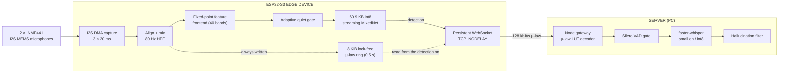

---

# 4. End-to-End Architecture

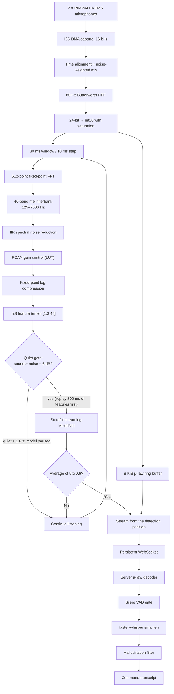

---

# 5. Getting Started

1. **Hardware.** You need an ESP32-S3 DevKit and one or two INMP441 microphones on GPIO 15 (WS), 16 (SCK) and 17 (SD).
   With two microphones, one has L/R to GND and the other has L/R to 3V3. Wiring details are in
   [`firmware/README.md`](firmware/README.md).
2. **Server.** Run it on a PC in the same 2.4 GHz network, in two terminals from the repository root:
   ```
   cd server/stt-services
   pip install -r requirements.txt
   uvicorn main:app --port 8000
   ```
   ```
   cd server
   npm install
   npm start
   ```
3. **Firmware** (ESP-IDF 5.5):
   ```
   cd firmware
   idf.py set-target esp32s3
   idf.py menuconfig          # KWS settings: Wi-Fi name and password, server ws://<PC-IP>:3000/ws
   idf.py -p <port> build flash monitor
   ```
4. **Try it.** Say "Marvin", then a command. The LED blinks green at the detection. The transcript appears in the
   serial monitor and in `server/recordings/index.jsonl`.

---

# 6. Audio Capture and Acoustic Frontend

## 6.1 Two microphones, time-aligned

Two INMP441s share SCK, WS and SD, so they sample at the same instants. One sits in the left I2S slot and the other in
the right. They are 55 mm apart, so a talker off to one side reaches the nearer microphone up to 160 µs (2.6 samples)
earlier. A plain average would cancel part of the voice (a notch at 3.1 kHz).

While someone speaks, `main/mic_align.c` does two things:

* **Alignment.** It cross-correlates the two microphones, finds that delay to a fraction of a sample, and delays the
  earlier one with a 4-tap fractional delay.
* **Mix.** It mixes the two by inverse noise power. A healthy pair is mixed about 50/50 and gains about 3 dB SNR. A
  faulty, noisy microphone is faded out instead of drowning the good one.

One microphone works too. `KWS_MIC_SELECT = 1` / `2` reads only that slot.

## 6.2 80 Hz high-pass filter

The INMP441 delivers 24-bit samples with a DC offset and low-frequency drift. A second-order **80 Hz Butterworth
high-pass biquad** removes them before the conversion to int16, so nothing clips:

```text
24-bit I2S samples (aligned + mixed)
   │
   ▼
2nd-order Butterworth HPF @ 80 Hz
   │
   ▼
Scale to 16 bit (optional digital gain, KWS_MIC_GAIN_SHIFT, default ×1)
   │
   ▼
int16 saturation → features + µ-law ring
```

The loop is branch-free and unrolled. The whole audio stage costs 0.85 % of one core with two microphones.

## 6.3 Feature frontend

The frontend is the TensorFlow Lite Micro microfrontend (`components/esp-micro-speech-features`). It is fixed-point
and **bit-identical to the features used in training**. A SIMD FFT from esp-dsp changed scores by up to 0.26 and was
rejected.

| Parameter        | Value                                   |
| ---------------- | --------------------------------------: |
| Window           | 30 ms                                   |
| Step             | 10 ms                                   |
| FFT              | 512-point (KissFFT, fixed-point)        |
| Channels         | 40 mel bands                            |
| Frequency range  | 125–7500 Hz                             |
| Noise reduction  | even smoothing 0.025, odd 0.06          |
| PCAN             | strength 0.95, offset 80, gain bits 21  |
| Log scale        | on, scale shift 6                       |
| Cost             | ~1.4 ms per 30 ms of audio              |

* **Noise reduction.** The stationary background is tracked per channel and subtracted before the network.
* **PCAN gain control.** Per-channel automatic gain, `(ε + M(t,f))^(-strength)`. `powf()` is used only once at
  start-up to build a lookup table. At run time the gain is an interpolated integer LUT lookup, so the latency is
  predictable.
* **Log compression.** A fixed-point log compresses the dynamic range into the scale the int8 model expects.

---

# 7. Stateful Streaming TinyML

## 7.1 Conventional approach

A sliding-window KWS model re-processes the whole ~1.5 s spectrogram (about 150 frames × 40 features) every time a
new frame arrives. Most of that work was already done.

## 7.2 Streaming approach

The model takes only the **3 newest feature frames** (`[1, 3, 40]` int8, 30 ms of audio) per call. It keeps its
temporal context in internal state, held in TFLite Micro resource variables (`VAR_HANDLE`, `READ_VARIABLE` and
`ASSIGN_VARIABLE`).

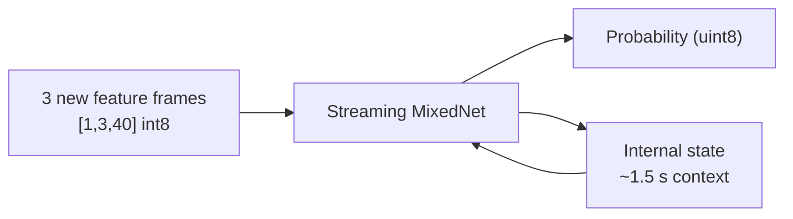

## 7.3 Model characteristics

| Property         | Value                                               |
| ---------------- | --------------------------------------------------: |
| Model            | microWakeWord MixedNet, streaming                   |
| Quantization     | full int8 (uint8 output)                            |
| Flash size       | 60,896 bytes (60.9 KB)                              |
| Tensor arena     | 26,624 bytes (25,964 used)                          |
| Input            | `[1, 3, 40]` int8                                   |
| Context          | ~1.5 s (`clip_duration_ms` 1500)                    |
| Inference        | 0.88 ms, once every 30 ms                           |
| Decision         | average of the last 5 outputs ≥ 0.6, 1 s cool-down  |
| Acceleration     | ESP-NN (through `esp-tflite-micro`)                 |

The architecture is made of multi-scale depthwise-separable convolutions (MixConv kernels 5, 7/11, 9/15 and 23, with
64 pointwise filters). The model uses 13 operator types.

---

# 8. Custom TFLite Micro Kernels

To update its state, the streaming model runs these operations on every inference:

```text
10 × STRIDED_SLICE
 8 × CONCATENATION
 2 × SPLIT_V
```

They only copy bytes, but TFLite Micro's reference kernels re-derive the tensor geometry on every call. Together these
operations took about 24 % of the model's time on the ESP32-S3.

## 8.1 Optimization

`main/fast_ops.cc` registers:

```text
Register_STRIDED_SLICE_FAST
Register_CONCATENATION_FAST
Register_SPLIT_V_FAST
```

```text
Prepare()                               (once)
   ├── Shapes and parameters are constant
   ├── Decide whether the op is a few contiguous copies
   └── Store that copy plan
            │
            ▼
Eval()                                  (every inference)
   └── memcpy along the stored plan
       (anything else falls back to the reference kernel)
```

## 8.2 Performance impact

```text
Reference kernels  →  1.07 ms per inference
Fast kernels       →  0.88 ms per inference   (~18 % less)
```

The outputs are **bit-identical** to the reference kernels on all 226 benchmark clips. `KWS_FAST_SLICE` is on by default.

---

# 9. Adaptive Quiet Gate

Running the network in a silent room wastes CPU. The firmware therefore tracks the background level, falling fast
and rising slowly. If the sound stays within **6 dB** of it for **1.6 s**, model inference pauses. The feature
frontend keeps running, so the background estimate stays current.

## 9.1 Quiet gate flow

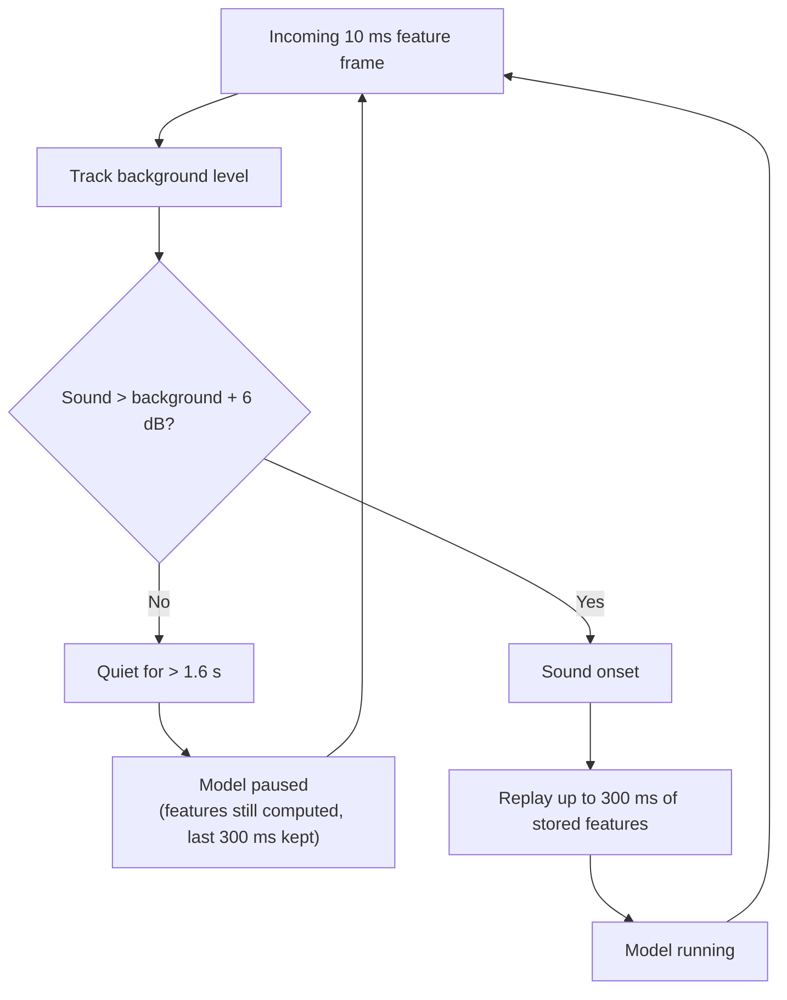

## 9.2 300 ms feature lookback

While the model is paused, a circular buffer keeps the last **30 feature frames (300 ms)**. When sound returns, those
frames are replayed through the model first, so a soft onset (the "M" of "Marvin") is not lost.

This lookback is **feature frames for the model only**. It is not audio sent to the server (see section 12).

With continuous speech in the room the model never pauses. The CPU figures in section 18 are measured that way, so
they are the worst case.

---

# 10. Dual-Core Architecture

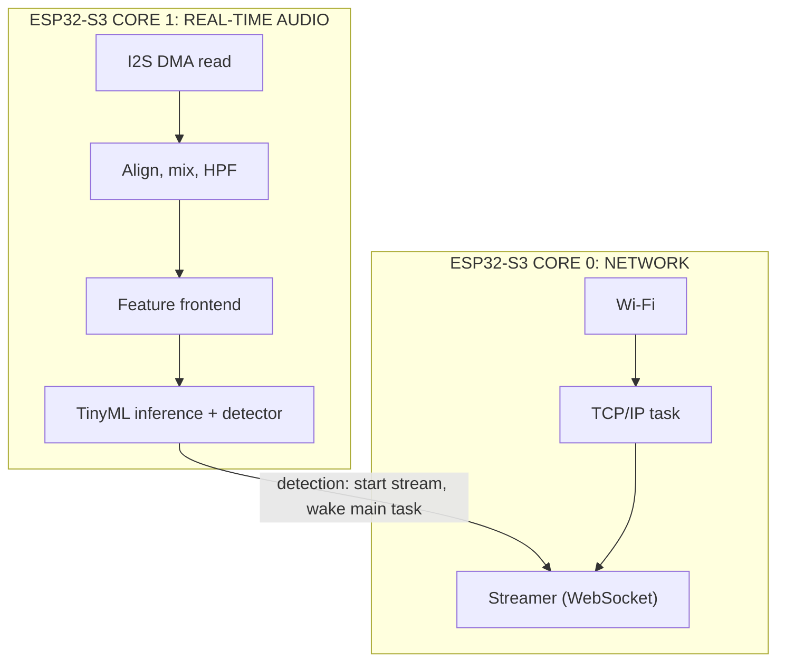

* **Core 1** (`audio_kws` task, priority 10): I2S capture, audio conditioning, features, model and detector. On a
  detection it only starts the stream and wakes the main task, which then logs and blinks the LED. Nothing on the
  audio path waits for the console or the LED.
* **Core 0**: Wi-Fi, the TCP/IP task (pinned) and the streamer.

Measured with continuous speech, two microphones, Wi-Fi and server connected: **core 1 ≈ 8.7 %, core 0 ≈ 0.7 %**.
Network activity cannot block the real-time audio path.

---

# 11. Audio Ring Buffer

The audio task writes every block, as µ-law, into an **8 KiB ring (0.5 s)**. The streamer on core 0 reads from it.

```text
   CORE 1 (single writer)                 CORE 0 (reader)
          │                                     │
          │ encode µ-law, write block           │ read from its own position
          │ then atomic_store(write index)      │ (starts at the detection)
          ▼                                     ▼
        ┌──────────────────────────────────────────┐
        │      8 KiB µ-law ring buffer (0.5 s)      │
        └──────────────────────────────────────────┘
```

* **Lock-free.** There is one writer. The write index is published with an atomic store after the data is written.
  The reader keeps its own position, so there is no mutex on the audio path.
* **The writer never waits.** If the reader falls more than ~0.47 s behind (a network stall), it skips to the oldest
  audio still in the ring. The skipped audio is counted and reported per command as `lost_ms`.
* In normal operation the counters stay at **0 lost (I2S and network)**.

---

# 12. Keyword Detection to Cloud Handoff

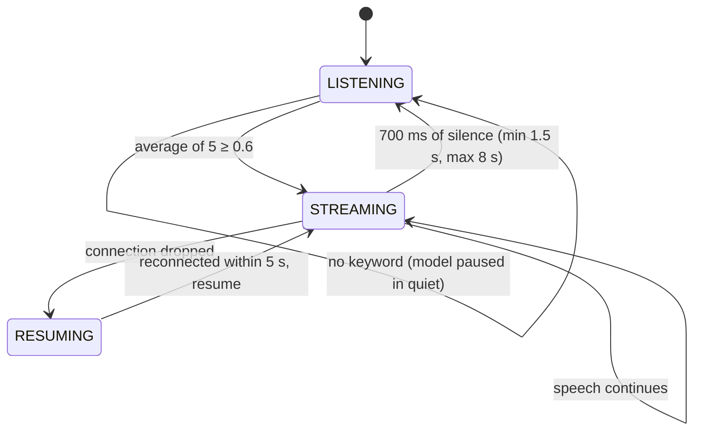

On a detection:

1. The stream starts at the **ring position of the detection itself**. With the default `KWS_PREROLL_MS = 0`, only
   audio after the detection is sent.
2. The first audio leaves the board **~21–26 ms** after the detection, in 20 ms messages (320 bytes of µ-law).
3. The server decodes each frame and forwards it to the speech recogniser as it arrives.
4. The Silero VAD gate checks for speech. `faster-whisper` transcribes, and the hallucination filter cleans the result.
5. The transcript goes back to the board (`{"type":"response","text":...}`) and to the live page.

A wake word said during a stream extends it, up to twice the maximum length.

About 100 ms passes between the end of "Marvin" and the detection. That audio is **not** streamed, so a command said
with no pause can lose its first syllable. A 250 ms pre-roll was verified on the board, but it was reverted because
some transcripts kept a fragment of the wake word.

---

# 13. µ-law Audio Compression

```text
16,000 samples/s × 16 bit = 256 kbit/s   (16-bit PCM)
16,000 samples/s ×  8 bit = 128 kbit/s   (G.711 µ-law)
```

This halves the audio payload. Each 20 ms frame is **320 bytes**. With the WebSocket header (8 B) and TCP/IP (40 B),
the total is about **147 kbit/s** on air. Nothing is sent at all while no command is being spoken.

---

# 14. Cloud ASR Pipeline

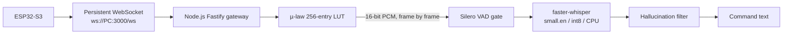

## 14.1 Gateway (`server/server.js`)

The gateway uses Fastify with `@fastify/websocket`. It decodes µ-law with a **256-entry lookup table** and saves every
command as a WAV plus a line in `recordings/index.jsonl`. It forwards each PCM frame to the STT service over a
WebSocket (`/stream`) as it arrives.

`/live` pushes every command (`start`, then `final`) to [`tools/transcription.html`](tools/transcription.html).

## 14.2 Speech check (Silero VAD)

The STT service runs faster-whisper's bundled **Silero VAD** first. If there is no speech (for example "Marvin" with
nothing after it), the result is an empty transcript at once, instead of text Whisper invented.

## 14.3 faster-whisper

```text
model:        small.en
quantization: int8, CPU
decoding:     beam 5, temperature 0, neutral punctuated prompt
```

A transcript is ready ~2–3 s after the speaker stops. Whisper always encodes 30 s of audio, so each call takes ~2 s on
an 8-thread laptop CPU. Transcriptions run one at a time.

## 14.4 Hallucination filter

The filter drops looping text (high compression ratio) and prompt echoes (low log-probability, prompt words only).
On the 79 server transcripts it was tested on, it removed **15 / 15** Whisper loops and prompt echoes and changed
no real command.

End-to-end command word error rate: **5.3 %** (34 of 35 synthetic "Marvin, <command>" clips transcribed, played
through the air to the board).

---

# 15. Model Training

The wake-word model was trained **from scratch** with [microWakeWord](https://github.com/kahrendt/microWakeWord). No
pre-trained wake-word weights were used. The notebook is
[`training/SIH_marvin_retrain_v2.ipynb`](training/SIH_marvin_retrain_v2.ipynb) (Google Colab, T4 GPU, 2.5–4 h).

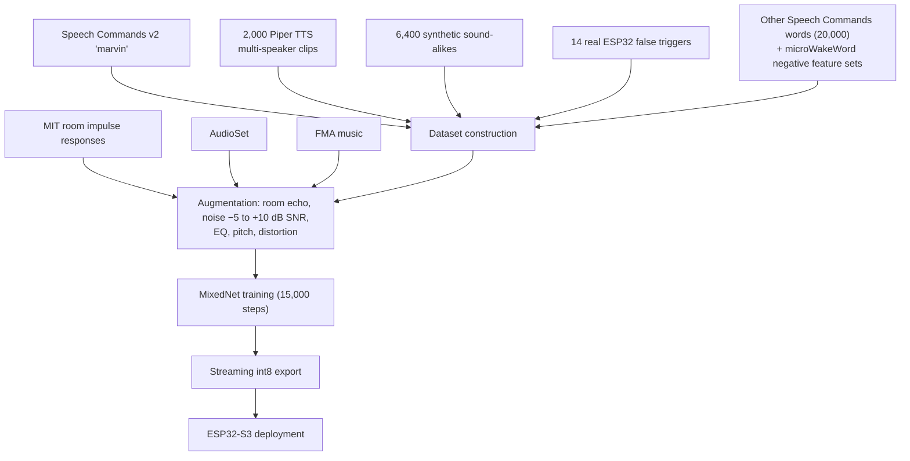

**Positives:**
* Google Speech Commands v2 "marvin", with its official speaker split
* 2,000 synthetic Piper TTS clips

**Negatives:**
* 20,000 other Speech Commands words
* 16 sound-alike phrases × 400 synthetic Piper voices
* 14 real false triggers recorded by the board, each used 10×
* microWakeWord's negative feature sets: speech, dinner-party conversation and no-speech

**Augmentation:**
* MIT room impulse responses
* Speech Commands noise, AudioSet and FMA music, at −5 to +10 dB SNR

**Cutoff.** The operating cutoff **0.6** was chosen on the frozen *validation* set (`benchmarks/sweep_window.py`), not
on the notebook's own test split.

The board recordings used in training (27 Sep, 04:18–06:00) do not overlap the frozen benchmark sets (27 Sep, 08:12
onward).

---

# 16. Hard-Negative Mining

Wake-word systems rarely fail because they cannot hear the target word. They fail because other words sound like it.

The 16 sound-alike phrases in the training set:

```text
martin, marvel, marble, carving, mark, markovnikov, pardon, can you,
margin, marlin, martian, marvelous, garvin, harvin, starving, carbon
```

That gives **6,400 synthetic clips** (16 × 400) plus the board's own false triggers. They form a separate training
set with its own sampling weight, `HARD_NEG_WEIGHT = 3.0`. Mixed into the 20,000 ordinary negatives, they would be
only ~2 % of the data.

## Hard-negative training loop

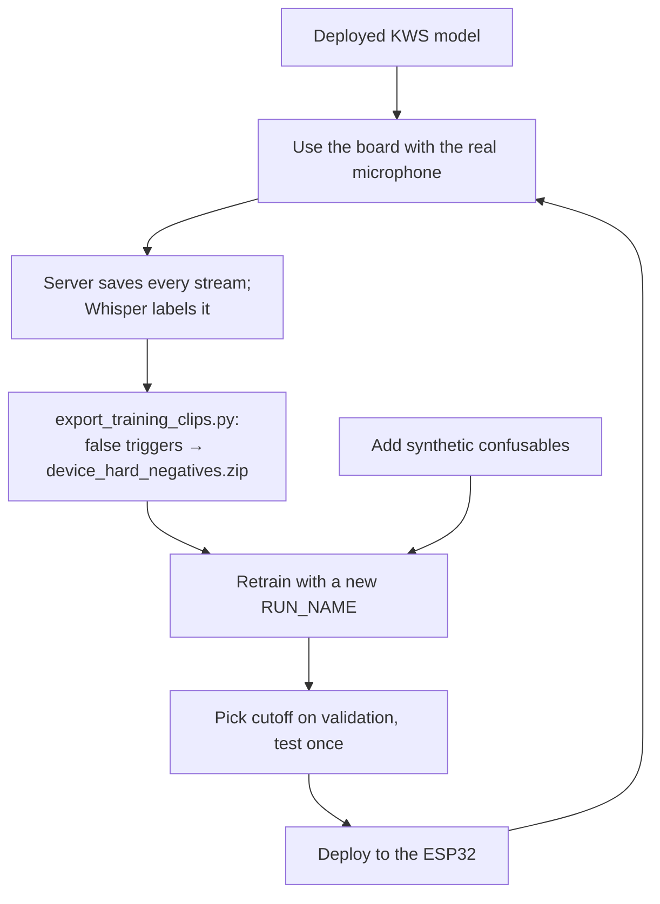

---

# 17. Memory Optimization

Everything is counted strictly: **IRAM code + static data + peak heap**, with Wi-Fi up and a command streaming. Units
are KiB (1024 B). PSRAM is disabled.

| Component                                         | Memory      |
| ------------------------------------------------- | ----------: |
| IRAM code (in internal SRAM)                      | 54.0 KiB    |
| Static data + peak heap (Wi-Fi, lwIP, model, buffers, stacks) | ~199 KiB |
| **Total, strict, while streaming**                | **253 KiB** |
| Limit                                             | 256 KiB     |

```text
253 KiB used / 256 KiB limit  →  ~3 KiB margin (two-microphone firmware)
```

The one-microphone build (`KWS_MIC_SELECT = 1`) measured **245 KiB**: 54.0 KiB IRAM + 40.5 KiB static data + 150.5 KiB
peak heap.

The 96 KiB of SRAM configured as flash cache is hardware cache, not software RAM, so it is excluded (and disclosed).

## The limit is enforced, not just reported

`KWS_RAM_LIMIT_KB = 256` is on by default. At boot the firmware allocates, and never frees, all internal RAM above
256 KiB minus the IRAM code, so the application **cannot** use more. The status line prints the strict peak, and
failed allocations are counted.

## Major memory optimizations

| Change | Effect |
|---|---|
| Wi-Fi, heap, ringbuf, RMT, event and FreeRTOS task code moved from IRAM to flash | IRAM 95.5 → 54.0 KiB (−41.5 KiB) |
| Wi-Fi static RX buffers 10 → 4, dynamic RX 32 → 16, A-MPDU RX off, 4 sockets | tens of KiB of heap |
| NVS, SoftAP, OWE, Enterprise, IPv6 and DHCP server disabled | smaller static data and heap |
| I2S DMA 6 → 3 × 20 ms, tensor arena 30 → 26 KB, stacks sized from measured high-water marks | smaller heap |
| PSRAM disabled | the budget is internal SRAM only |

The TX-side Wi-Fi buffers were **not** shrunk. That was tried: it delayed the first audio by up to 424 ms and lost
audio, so it was reverted.

Before these changes the same strict reading gave **343 KiB**.

---

# 18. CPU Optimization

The budget is **< 10 % CPU while idle-listening**. It is measured strictly:

* both cores summed
* continuous speech in the room, so the model never pauses
* Wi-Fi and server connected
* 6 minutes long
* the highest 10 s window must also stay under 10 %

| Condition (current two-microphone firmware) | CPU |
| --- | ---: |
| Continuous speech, both cores, mean | **9.43 %** |
| Highest 10 s window | 9.9 % |
| Per core (core 1 / core 0) | ~8.7 % / ~0.7 % |
| Quiet room (one-microphone build, 29 Sep) | 8.5 % mean |

The baseline before optimization was 14.4 %. It came down through a series of independent optimizations:

```text
Streaming inference (3 frames per call)
  + int8 quantization and ESP-NN
  + fast state-copy kernels (1.07 → 0.88 ms)
  + dashboard telemetry off by default (−4 % on core 0)
  + branch-free audio loop
  + detection work (logging, LED) moved off the audio task
  + event-driven main loop, ping 2 → 5 s, watchdog fed twice a second
  + quiet-room gating
  + dual-core isolation
       ↓
9.43 % mean (both cores) with continuous speech
```

---

# 19. Boot Self-Test

At every boot the firmware:

1. Applies the 256 KiB RAM limit.
2. Loads the model and checks its input shape. A 1-second classifier is rejected. With no model at all, the board runs
   in microphone-test mode.
3. **Noise test** (`KWS_SELFTEST`, on by default): feeds 3 s of deterministic LCG noise (about −66 dBFS) through the
   full pipeline. The model must stay quiet.
4. **Wake-word test** (optional): if a 16 kHz 16-bit `.wav` of the wake word is placed in `firmware/model/`, it is
   played between 1.2 s and 0.6 s of noise, and the model must detect it. Recordings are git-ignored, so the
   repository does not ship one.
5. **Microphone check**: finds which I2S slots carry a working microphone. A slot counts only with varying samples at a
   plausible level, which catches dead or floating inputs and wiring errors. It logs the levels, and turns the LED red
   if no microphone delivers data.
6. Starts Wi-Fi, the streamer and continuous KWS.

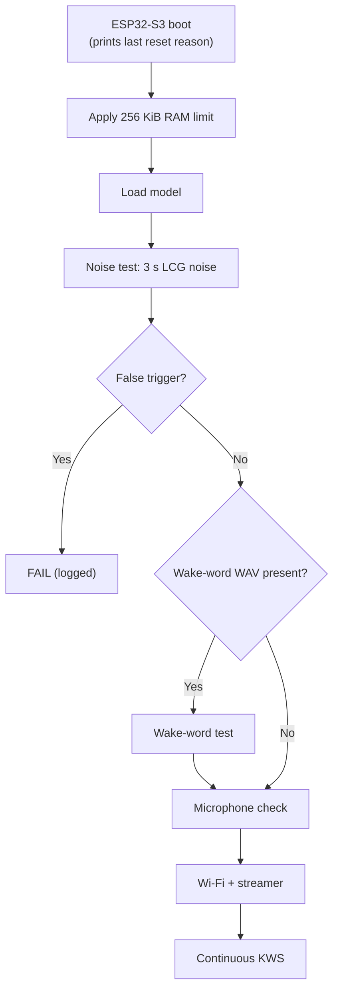

---

# 20. Deterministic Hardware-in-the-Loop Testing

Live microphone tests cannot be repeated exactly. The firmware therefore has a separate build mode:

```text
KWS_INJECT_TEST=y
```

In this mode, frozen WAV files are sent over the serial port at **921600 baud** into the board's own pipeline
(`ww_process()`). The board runs the same features, model and detector as in production.

```text
Frozen WAV (SHA-256-hashed test set)
     ↓
UART @ 921600 (benchmarks/run_injected.py)
     ↓
ESP32-S3: ww_process() → features → model → detector
     ↓
Detection result
```

Results on the frozen real test set at cutoff 0.6:

```text
33 / 33 wake words detected  (TPR 100 %, 95 % lower bound 89 %)
```

The same mode verified that the fast kernels are bit-identical (226 clips). It also measured the false-trigger rates
in section 25.

---

# 21. Performance Metrics

All numbers come from the board, using the scripts in [`benchmarks/`](benchmarks). Raw results are in
`benchmarks/results/` and the full report is [`benchmarks/REPORT.md`](benchmarks/REPORT.md).

| Metric | Result |
| --- | ---: |
| Model size (flash) | **60.9 KB** (60,896 B), int8 |
| Tensor arena | 26 KB (25,964 B used) |
| Strict RAM (IRAM + static + peak heap, streaming) | **253 KiB** of 256 KiB (enforced) |
| PSRAM | **0 B** (disabled) |
| CPU, both cores, continuous speech | **9.43 %** mean, highest 10 s window 9.9 % |
| KWS inference | **0.88 ms** per 30 ms (reference kernels: 1.07 ms) |
| Feature frontend | ~1.4 ms per 30 ms |
| Detection → first audio sent | **21–26 ms** |
| End of wake word → first audio at the server | **122 ms median**¹ (p95 323 ms, 35 trials) |
| µ-law payload bitrate | 128 kbit/s (50 % of PCM), ~147 kbit/s on air |
| Wake word, frozen real test set (injected) | **33 / 33** (100 %) |
| Wake word, synthetic commands through the air | 35 / 40 (87.5 %) |
| Command WER (synthetic commands, end to end) | **5.3 %** |
| Whisper hallucinations removed by the filter | 15 / 15, no real command changed |
| Audio lost in normal operation | **0** (I2S and network) |

¹ Measured on the one-microphone firmware of 29 Sep. A 15-trial re-check of the current firmware gave 140 ms. Almost
all of the latency is the detector's 5-output average (~100 ms). Buffering and encoding add ~20 ms and Wi-Fi ~1 ms.

---

# 22. Resource Budget

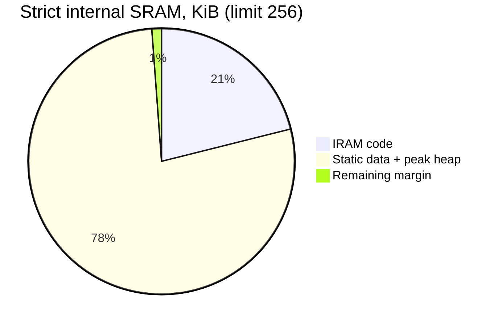

```text
256 KiB limit
│
├──  54 KiB   IRAM code
├── ~199 KiB  static data + peak heap (Wi-Fi up, streaming)
└──  ~3 KiB   remaining margin
```

No PSRAM is used. Internal RAM is the whole budget.

---

# 23. Reliability & Fault Handling

## Microphone diagnostics

At boot, each I2S slot is checked for dead, floating or mis-wired input (section 19). While running, a microphone that
becomes much noisier than its partner is faded out of the mix.

## Network recovery

| Mechanism | Setting |
| --- | --- |
| WebSocket reconnect | every 1 s when idle, every 200 ms while a command waits |
| Keep-alive ping | every 5 s (20 s ping-pong timeout) |
| Mid-command drop | the stream waits up to 5 s for the link, then sends a `"resume"` start (up to 3 per command); the failed chunk is re-sent |
| Server side | keeps the interrupted recording (`.part`) for 30 s, appends the resumed audio, and makes one WAV and one transcript |
| Undeliverable command | the LED blinks red and `lost_ms` is reported |

This was tested with a TCP proxy that cut the connection for 0.5, 1 and 2 s after a detection. Each test produced one
recording and one transcript. Only the part of the outage longer than the 0.47 s ring was lost.

## Watchdogs

* The audio task and the main loop are watched by the task watchdog. A hang restarts the board after 5 s.
* 5 s without I2S data also restarts the board.
* The boot banner prints why the board last restarted.

## End of command

The stream stops after **700 ms of silence** (sound below the background + 10 dB), with a minimum of 1.5 s and a
maximum of 8 s. No trailing audio is sent.

---

# 24. Security Considerations

This is a prototype for a trusted network (a lab LAN or laptop hotspot):

* The transport is plain `ws://` without authentication. Anyone who can reach port 3000 can send audio or read `/live`.
* The STT service binds to `127.0.0.1` only. Do not expose it.
* Wi-Fi credentials are compiled in through `sdkconfig`, which is git-ignored.
* Recordings (`server/recordings/`) are git-ignored and must not be published.

Planned for a public deployment:

```text
ws://  →  wss://  (TLS)  +  per-device token
```

A further option is **4-bit IMA-ADPCM**, which would halve the payload again:

```text
Current:   16-bit PCM → 8-bit µ-law   → 128 kbit/s
Planned:   16-bit PCM → 4-bit ADPCM   →  64 kbit/s  (~83 kbit/s on air)
```

---

# 25. Current Limitations

## 25.1 Phonetic false triggers (the main open issue)

At cutoff 0.6, words that sound like "Marvin" still fire:

| Test | Result |
| --- | ---: |
| Synthetic sound-alikes that fire (Martin, Marvel, Kevin, Melvin, Morgan...) | 54 / 120 (45 %) |
| Real recorded false triggers that still fire | 9 / 17 |
| False accepts per hour, synthetic read speech (PC) | 0.64 / h |
| False accepts per hour, real room audio | **not yet measured** |

These words score like a real "Marvin" (up to 0.9+), so no threshold fixes it.

The fix is a retrained model (v3) with more and heavier sound-alike negatives, plus the board's recorded false
triggers. The steps are in [`training/`](training) and [`benchmarks/REPORT.md`](benchmarks/REPORT.md) (H2, H3).

## 25.2 Evaluation coverage

The real test recordings are **one speaker in one room**, and all through-the-air tests use synthetic voices. TPR
across speakers, distances and noise levels is not yet measured.

## 25.3 Tight resource margins

The margins are **253 / 256 KiB** RAM and **9.9 % / 10 %** CPU in the worst 10 s window. Any addition (Wi-Fi buffers,
model size, logging, features) must be re-measured. The RAM limit is enforced by the firmware. The CPU limit is not,
so re-run `benchmarks/run_final.ps1` after every change.

## 25.4 First ~100 ms after the wake word

This audio is not streamed (`KWS_PREROLL_MS = 0`). A command spoken with no pause after "Marvin" can lose its first
syllable.

## 25.5 Network dependency for ASR

```text
No network:  wake-word detection → still works on the board
             command transcription → unavailable
```

---

# 26. Production Roadmap

## Phase 1: current

```text
ESP32-S3 + 2 × INMP441 + 60.9 KB int8 KWS + local wake-word detection
+ µ-law streaming to a Whisper server
```

## Phase 2: fewer false activations

```text
8 h of real negative audio → false triggers collected
      ↓
Retrain v3 (more sound-alikes, HARD_NEG_WEIGHT 5, board false triggers)
      ↓
Cutoff on validation → test once → firmware update
```

## Phase 3: secure streaming

```text
ws:// → wss:// + device authentication, Wi-Fi provisioning, OTA updates
```

## Phase 4: lower bandwidth and latency

```text
128 kbit/s µ-law → 64 kbit/s IMA-ADPCM
250 ms pre-roll with a robust wake-word strip on the server
```

## Phase 5: larger-scale deployment

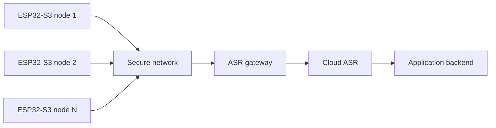

No device streams continuously, so the ASR load grows with the number of commands, not the number of devices.

---

# 27. Project Structure

```text
.
├── firmware/                         ESP-IDF project (ESP32-S3)
│   ├── main/
│   │   ├── main.c                    start-up, RAM limit, audio task, status line
│   │   ├── audio_input.c             I2S, mic check, 80 Hz HPF, µ-law ring
│   │   ├── mic_align.c               two-microphone alignment + noise-weighted mix
│   │   ├── wake_word.cpp             frontend + TFLite Micro + detector + quiet gate
│   │   ├── fast_ops.cc               fast STRIDED_SLICE / CONCATENATION / SPLIT_V
│   │   ├── streamer.c                WebSocket streaming, resume after a drop
│   │   ├── wav_selftest.c            boot self-test
│   │   ├── wifi.c, status_led.c
│   │   └── Kconfig.projbuild         all KWS_* settings
│   ├── components/esp-micro-speech-features/   TFLM microfrontend (fft, filterbank,
│   │                                 noise_reduction, pcan_gain_control, log_scale)
│   ├── model/                        marvin.tflite + marvin.json (deployed model)
│   ├── test/test_mic_align.c         PC unit test
│   └── sdkconfig.defaults            the tested, locked build profile
├── server/
│   ├── server.js                     Fastify WebSocket gateway (/ws, /live)
│   └── stt-services/main.py          FastAPI + faster-whisper small.en
├── training/
│   ├── SIH_marvin_retrain_v2.ipynb   Colab training notebook
│   ├── check_model.py                PC mirror of the on-device pipeline
│   └── export_training_clips.py      board recordings → training clips
├── benchmarks/                       measurement scripts, frozen sets, results/, REPORT.md
└── tools/                            dashboard, serial logger, fake device, live transcript page, report
```

---

# 28. Frequently Asked Questions

**What runs on the ESP32?**
A 60.9 KB fully int8 streaming MixedNet decides the wake word on the board. It is fed by a fixed-point frontend with
40 mel bands, noise reduction, PCAN and log compression, which in turn follows two time-aligned microphones and an
80 Hz high-pass filter.

**Why not stream audio to the cloud all the time?**
It wastes bandwidth and cloud compute on background audio, and it sends audio nobody meant to send. The board decides
locally and streams only after the wake word.

**Why is the model so small?**
It is fully int8, built from depthwise-separable convolutions, and streaming. Each call processes only the 3 newest
feature frames, while the temporal context lives in the model's internal state.

**How much RAM does it use?**
253 KiB while streaming, counted strictly (IRAM code + static data + peak heap), against a 256 KiB limit. PSRAM is
disabled.

**How do you prove the memory limit?**
At boot the firmware permanently reserves all internal RAM above 256 KiB (minus the IRAM code). The application
physically cannot allocate more, and the status line prints the strict peak.

**How fast is inference?**
0.88 ms per call (one call per 30 ms of audio), after the custom state-copy kernels. The reference kernels took 1.07 ms.

**What do the custom kernels change?**
They work out the copy plan once in `Prepare()`, and `Eval()` becomes `memcpy`. The outputs are bit-identical to
TFLite Micro's reference kernels.

**How do you handle noise?**
Several stages work together:
* two microphones, mixed by their noise
* an 80 Hz high-pass filter
* per-channel spectral noise reduction
* PCAN gain control and log compression
* training with room echo and −5 to +10 dB background noise

**How do you avoid missing the start of the wake word after a quiet period?**
While the model is paused, the last 300 ms of feature frames are kept and replayed through the model as soon as sound
returns.

**What happens after the wake word?**
The board streams µ-law audio from the detection on, over an always-open WebSocket. The server decodes it, gates it
with Silero VAD, transcribes it with faster-whisper small.en and filters hallucinations.

**Why µ-law?**
It halves the payload (256 → 128 kbit/s) at almost no CPU cost, and the decoder is a 256-entry table.

**What is the handoff latency?**
From the end of the wake word to the first audio at the server: median 122 ms (35 trials), or 140 ms in a 15-trial
re-check of the current firmware. That is ~100 ms of detection delay (the 5-output average), ~20 ms of buffering and
encoding, and ~1 ms of Wi-Fi.

**How do you test the model reproducibly?**
An injection build feeds frozen, SHA-256-hashed WAV sets over the serial port at 921600 baud into the board's own
pipeline.

**How accurate is it?**
* 33/33 detected on the frozen real test set (one speaker)
* 35/40 synthetic commands detected through the air
* 5.3 % command WER

False activations are the open issue: 45 % of synthetic sound-alikes still fire (section 25). A retrain is the fix.

---

# 29. Key Engineering Innovations

1. **Stateful streaming TinyML.** 3 new frames per call instead of re-running a 1.5 s window.
2. **Training-identical fixed-point frontend.** The bit-exact microfrontend with LUT-based PCAN. A faster SIMD FFT was
   rejected because it changed the scores.
3. **Custom TFLite Micro kernels.** They target the model's state-copy overhead rather than convolution speed: −18 %
   inference time, bit-identical outputs.
4. **Adaptive compute gating.** The model pauses in quiet and replays 300 ms of features on sound onset.
5. **Two-microphone alignment.** Sub-sample delay estimation and a noise-weighted mix, so the voice adds in phase from
   any direction and a faulty microphone is faded out.
6. **Asymmetric dual-core design.** Core 1 runs real-time audio + KWS and core 0 runs Wi-Fi + WebSocket, joined by a
   lock-free ring.
7. **Firmware-enforced resource compliance.** The 256 KiB limit is reserved at boot, not just reported.
8. **Loss-free handoff.** The stream starts at the detection's ring position, resumes after a dropped connection, and
   reports anything lost.
9. **Edge-to-cloud partitioning.**

   ```text
   ESP32-S3                         Server
   ──────────────────────           ──────────────────────
   Wake-word detection              Speech check (VAD)
   Audio conditioning               Whisper ASR
   µ-law compression                Hallucination filter
   Real-time control                Recording + live view
   ```

---

# 30. Credits and Licences

| Part | Project | Licence |
| --- | --- | --- |
| Model training | [microWakeWord](https://github.com/kahrendt/microWakeWord) | Apache-2.0 |
| Feature frontend | TensorFlow Lite Micro microfrontend (`firmware/components/esp-micro-speech-features`) | Apache-2.0 |
| Runtime | `espressif/esp-tflite-micro` and `esp-nn` | Apache-2.0 |
| Speech-to-text | faster-whisper with Whisper small.en | MIT |

Detection logic follows ESPHome's `micro_wake_word`. No proprietary wake-word SDK is used.

Datasets and their licences are listed in [`training/README.md`](training/README.md). Some of microWakeWord's negative
sets are CC-BY-NC: fine for SIH, but not for a commercial product.

---

# 31. Conclusion

This project is a complete **edge-to-cloud speech pipeline** built on a highly constrained ESP32-S3.

The central design principle is:

> **Do the smallest amount of computation necessary on the edge to decide when expensive computation is actually required.**

```text
             ┌─────────────────────────────┐
             │       ESP32-S3 EDGE         │
             │                             │
2 mics ─────►│ Align → HPF → Features      │
             │        → TinyML (int8)      │
             │             │               │
             │             ▼               │
             │        Wake word            │
             │             │               │
             │             ▼               │
             │    µ-law ring + WebSocket   │
             └─────────────┬───────────────┘
                           │
                           ▼
             ┌─────────────────────────────┐
             │           SERVER            │
             │                             │
             │ µ-law → VAD → Whisper       │
             │             ↓               │
             │       Command text          │
             └─────────────────────────────┘
```

### Measured system metrics

**60.9 KB model • 253 KiB strict RAM (enforced 256) • 0 B PSRAM • 0.88 ms inference • 9.43 % CPU (both cores) •
122 ms median handoff • 128 kbit/s µ-law • 33/33 frozen real test clips • 5.3 % command WER • 0 audio lost**
