# Edge Wake-Word + Cloud ASR Handoff on ESP32-S3

An always-on wake-word detector that fits on an ESP32-S3 with **no PSRAM**, inside a **256 KiB RAM budget** and **under 10% CPU**. It listens for one custom keyword, "Marvin". Only after it hears it does the board stream audio to a cloud speech recogniser.

I built this for a hackathon challenge (SIH) that set exactly those limits: under 256 KiB RAM, under 10% idle CPU, a custom keyword, open-source tools only, and low latency from keyword to cloud.

<!-- add a demo GIF or video link here -->

## Results

| Metric | Result |
|---|---|
| Model | 60.9 KB, full int8 (60,896 bytes in flash) |
| Tensor arena | ~26 KB, internal SRAM |
| Inference | 0.88 ms per step (1.07 ms before my custom kernels) |
| Internal SRAM | 245 KiB peak of the 256 KiB limit, 0 bytes PSRAM |
| CPU, both cores | 9.18% mean with continuous speech playing, 8.51% in a quiet room |
| Keyword end to server | 122 ms median |
| Detection on frozen real clips | 33 / 33 |
| Command WER (cloud) | 5.3% |
| Dropped I2S frames | 0 |

All numbers are from my own board, over a local hotspot with plain `ws://`. The test set is small (33 clips), so read 33/33 as "works on my recordings", not as a field accuracy figure. The known weak spot is sound-alike words; see [Limitations](#limitations).

**Hardware:** ESP32-S3-WROOM-1, INMP441 I2S MEMS microphone. **Software:** ESP-IDF 5.5, TFLite Micro, ESP-NN.

## How it works

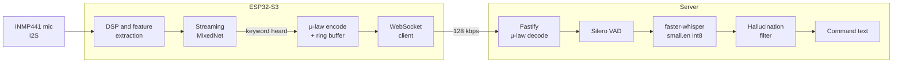

The idea is simple: do the smallest possible amount of work on the chip to decide *when* the expensive work (speech recognition) is needed. Everything below is one piece of making that fit in the budget.

---

## Features

### 1. Cleaning up the microphone signal

**Problem.** The INMP441 outputs 24-bit audio with a DC offset and slow low-frequency drift. If you apply digital gain first, that offset gets amplified and clips.

**What I did.** A 2nd-order 80 Hz Butterworth high-pass filter runs *before* an 8x digital gain and int16 saturation. Speech sits well above 80 Hz, so nothing useful is lost.

At boot the firmware also checks the I2S line for a dead or floating input (`mic_check()`), which catches wiring mistakes early. The repo has an optional two-mic alignment path (`mic_align.c`, 4-tap cubic Lagrange fractional delay), but the production build uses one mic in mono, which saves about 5 KB of DMA RAM.

### 2. Fixed-point feature extraction

**Problem.** The model needs a compact, noise-tolerant representation of the audio, and the MCU has no room for floating-point-heavy DSP.

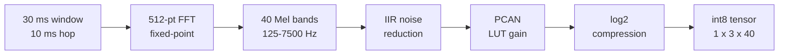

| Stage | Problem it solves | How |
|---|---|---|
| Mel filterbank | Raw FFT is too big and not speech-shaped | 40 triangular bands, 125-7500 Hz |
| IIR noise reduction | Steady background noise (fans, hum) | Per-channel noise estimate, smoothing 0.025 / 0.06 (even / odd channels), subtracted from the spectrum |
| PCAN | Loud and quiet speakers should look similar | Per-channel gain of (ε + M)^-α with strength 0.95, offset 80 |
| PCAN via lookup table | `powf()` is slow and its timing varies | Precomputed 16-bit LUT, integer math only |
| log2 | Huge dynamic range | Fixed-point log2, scaled to int8 for the model |

The frontend comes from the `esp-micro-speech-features` component (`frontend.c`, `noise_reduction.c`, `pcan_gain_control.c`, `log_scale.c`).

### 3. Stateful streaming model

**Problem.** A normal keyword CNN re-reads a 1.5 s spectrogram (149 frames x 40) every step. Almost all of that data was already processed one step ago.

**What I did.** The model is a streaming MixedNet (multi-scale depthwise-separable convolutions, full int8). Each step it takes only the **3 newest frames** (`[1, 3, 40]`, 30 ms) and keeps ~1.5 s of history in TFLite Micro *resource variables*.

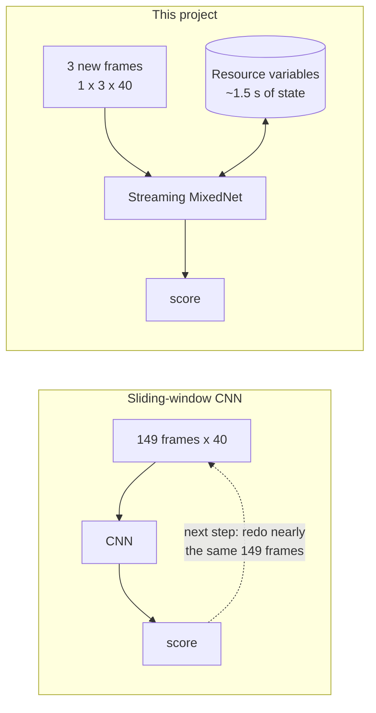

Inference is accelerated with ESP-NN and takes 0.88 ms per step, which is roughly 3% of a 30 ms hop.

### 4. Custom TFLite Micro kernels

**Problem.** Keeping state means shifting tensors around. Each inference runs 10 `STRIDED_SLICE`, 8 `CONCATENATION` and 2 `SPLIT_V` ops. The stock kernels recompute shapes and multi-dimensional indices on every call, and that overhead was around a quarter of model execution time.

**What I did.** I registered fast versions of those three ops (`Register_STRIDED_SLICE_FAST`, `Register_CONCATENATION_FAST`, `Register_SPLIT_V_FAST` in `fast_ops.cc`). The shapes and byte offsets are worked out once in `Prepare()`, so `Eval()` is just a `memcpy`.

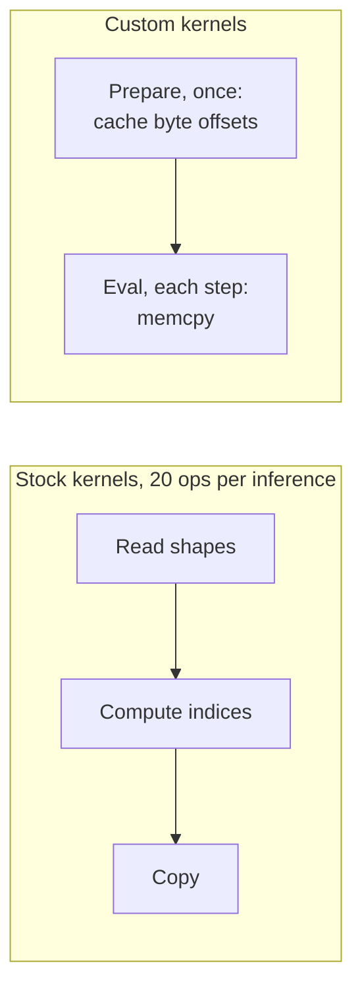

Result: **1.07 ms to 0.88 ms (-18%)**, with outputs bit-identical to the stock kernels on all 226 benchmark clips.

### 5. Quiet gate and 300 ms lookback

**Problem.** In a quiet room, running the network every 30 ms is wasted work. But if you pause it, you risk missing the soft start of a word like "M-arvin".

**What I did.** The firmware tracks the room noise floor. If audio stays within 6 dB of it for more than 1.6 s, the model pauses (the frontend keeps running, so the noise floor stays current). A 30-frame circular buffer (~300 ms) keeps recent feature frames. When energy rises 6 dB above the floor, those frames are replayed through the model first, then live streaming resumes.

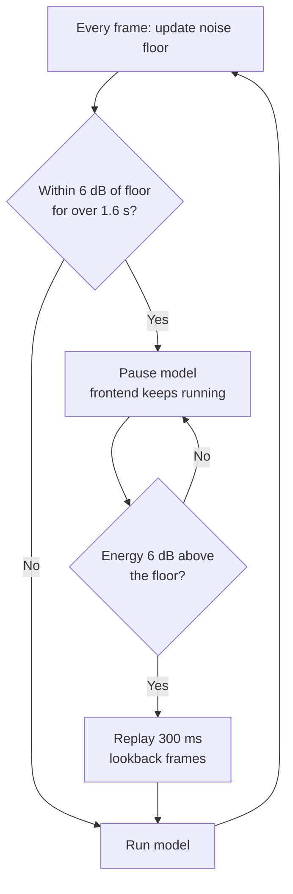

Honest note: the measured saving is small (8.51% quiet vs 9.18% with speech), because the model is only a small share of the total CPU. The gate matters more for the idea than for the number.

### 6. Dual-core split and lock-free audio handoff

**Problem.** Wi-Fi and TCP can stall for tens of milliseconds. If that shares a core with audio capture, you drop samples.

**What I did.** Core 1 runs everything real-time (I2S, DSP, features, inference, μ-law encode). Core 0 runs Wi-Fi, TCP/IP and the WebSocket sender. They talk through an 8 KiB power-of-two ring buffer using C11 atomic read/write indices, so there is no mutex on the audio path.

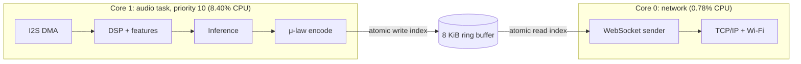

The two core loads add up to the 9.18% figure above. Dropped I2S frames in testing: 0.

### 7. Keyword to cloud handoff

**Problem.** Opening a connection after the wake word adds delay, and small packets can sit in TCP's send buffer.

**What I did.**

- **Persistent WebSocket**, kept warm with a 2 s ping, so there is no handshake after the keyword.
- **`TCP_NODELAY`** so 320-byte audio frames go out immediately instead of waiting on Nagle's algorithm.
- **G.711 μ-law**: 16-bit / 16 kHz PCM is 256 kbps; 8-bit μ-law is 128 kbps (320 bytes per 20 ms frame).
- **Adaptive end of speech:** the stream stops after 700 ms below the live noise floor + 10 dB, instead of a fixed recording window.
- **Recovery:** 1 s reconnect, 2 s keep-alive, and up to 20 s of hotspot-stall tolerance.

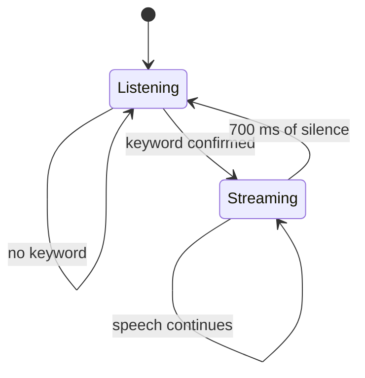

Where the 122 ms median comes from:


### 8. Cloud side

**Problem.** A big ASR model can't run on the chip, and Whisper sometimes echoes its prompt or loops on short commands.

**What I did.** A Node.js Fastify server decodes μ-law with a 256-entry lookup table and hands the audio to a FastAPI service running Silero VAD and `faster-whisper` (`small.en`, int8). A hallucination filter cleans the output. In my tests it caught all 15 prompt-echo/loop cases, and command WER was 5.3%.

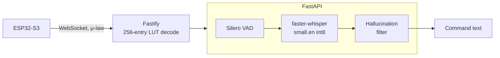

### 9. Staying under 256 KiB

**Problem.** The first working build used 343 KiB of internal SRAM once Wi-Fi was running. The challenge counts everything: code in IRAM, static data, and peak heap.

**What I did.** Got it down to 245 KiB:

| Component | Size |
|---|---|
| IRAM code | 54.0 KiB |
| Static `.data` / `.bss` | 40.5 KiB |
| Peak heap (Wi-Fi streaming active) | 150.5 KiB |
| **Total** | **245 KiB** (11 KiB margin) |

How the 343 to 245 KiB reduction happened:

- Moved non-ISR Wi-Fi / FreeRTOS / ringbuf functions from IRAM to flash (about -41.5 KiB IRAM)
- Disabled NVS, SoftAP and IPv6
- Tuned I2S DMA to 3 x 20 ms buffers and trimmed Wi-Fi RX buffers
- Mono single-slot I2S, PSRAM disabled

To check the limit rather than just claim it, the firmware enforces it. The S3 has more internal SRAM than the challenge allows, so at boot `apply_ram_limit()` computes 256 KiB minus IRAM code and allocates all free internal SRAM above that mark as ballast. Wi-Fi, TFLite Micro and the WebSocket then have to run in what's left.

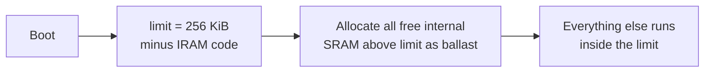

The margin is thin. Any new buffer, log or feature can break it, so the build profile is locked and there's a regression script (`run_final.ps1`).

### 10. Self-test and repeatable on-device testing

**Problem.** Live-mic tests can't be repeated exactly, and a broken arena or frontend should be caught before the mic opens.

**What I did.** At every boot, a self-test under 1 s feeds deterministic LCG noise (must *not* trigger) and an embedded reference WAV (must trigger). For regression testing there's a `KWS_INJECT_TEST` build that sends frozen WAVs over UART at 921600 baud straight into `ww_process()`.

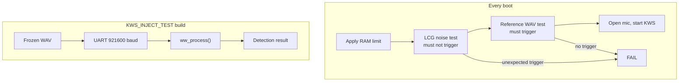

The 33/33 result comes from this injection path on frozen real clips.

---

## Training

The model is trained from scratch (no pretrained wake-word weights). Notebook: `training/SIH_marvin_retrain_v2.ipynb`.

**Data:** Speech Commands v2, 2,000 synthetic multi-speaker clips from Piper TTS, MIT room impulse responses, AudioSet and FMA music as background, mixed at roughly -5 to +10 dB SNR.

**Hard negatives.** Wake-word models usually fail on look-alike words, not on the keyword itself. I generated 6,400 synthetic clips across 16 sound-alike classes (Martin, Marvel, Marble, Carving, Margin and so on) and added real false triggers recorded from the ESP32-S3's own mic (`tools/export_training_clips.py`). Hard negatives are weighted 3.0 in the loss.

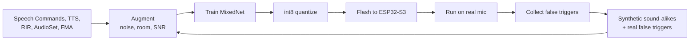

---

## Limitations

- **Sound-alike words still trigger it.** On the synthetic sound-alike set the trigger rate is about 45% at a 0.6 threshold; Martin, Marvel and Melvin are the worst. Hard-negative retraining is the fix in progress.
- **Small test set.** 33 clips is enough to show it works, not enough for a confident accuracy claim. There's no false-accepts-per-hour number yet.
- **Thin memory margin.** 245 of 256 KiB.
- **Cloud needed for transcription.** Wake-word detection works offline; the command text does not.
- **No transport security yet.** The stream is plain `ws://` on a local hotspot.

## Roadmap

1. `wss://` with TLS and per-device token auth
2. 4-bit IMA-ADPCM in place of μ-law, halving bandwidth again (128 to 64 kbps)
3. Keep looping: field false triggers, then hard-negative retraining, then firmware update

## Repo layout

```text
kws_s3_firmware/
├── kws_s3/
│   ├── main/
│   │   ├── main.c            # tasks, RAM limit, boot flow, UART inject loop
│   │   ├── audio_input.c     # I2S, 80 Hz HPF, gain, mic check, ring buffer
│   │   ├── wake_word.cpp     # frontend glue, model, quiet gate, lookback
│   │   ├── fast_ops.cc       # custom TFLM slice/concat/split kernels
│   │   ├── streamer.c        # WebSocket, μ-law, silence stop, reconnect
│   │   ├── mic_align.c       # optional two-mic alignment
│   │   └── wav_selftest.c    # boot self-test
│   ├── components/esp-micro-speech-features/
│   │   └── src/              # frontend, noise reduction, PCAN, log scale
│   └── tools/export_training_clips.py
├── training/SIH_marvin_retrain_v2.ipynb
└── Final Report.md
server/                       # Fastify + FastAPI + faster-whisper (adjust path)
```

## Build and run

Fill in the bracketed parts for your setup.

```bash
cd kws_s3_firmware/kws_s3
idf.py set-target esp32s3
# set Wi-Fi SSID/password and server address: <where you configure these>
idf.py build flash monitor

# server
<command to start the Fastify + FastAPI services>
```

For the injection test, build with `KWS_INJECT_TEST` enabled (`<how you enable it>`) and send frozen WAVs over UART at 921600 baud.

## Credits

Built on ESP-IDF, TensorFlow Lite Micro, ESP-NN and microWakeWord, with the `esp-micro-speech-features` frontend component. Cloud side uses Silero VAD and faster-whisper. Training data: Speech Commands v2, MIT room impulse responses, AudioSet, FMA, and Piper TTS voices.

