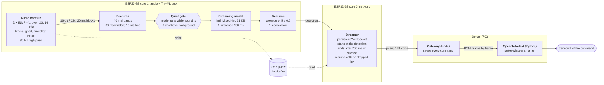

# On-device wake word + streaming speech recognition (ESP32-S3)

Smart India Hackathon, problem statement 26172: a low-power voice activator. An ESP32-S3 listens for the wake word
**"Marvin"** with a small neural network running on the chip itself, and only after it hears it streams what the
speaker says next to a server, which writes the command down ("Marvin, turn on the lights" → "Turn on the lights.").

* The wake word is decided on the board (TensorFlow Lite Micro, int8 streaming model, no cloud in the loop).
* Nothing is sent before the wake word; after it, the audio goes out in 20 ms packets over a WebSocket that is
  always open, so the server has the first audio about 25 ms after the detection.
* It fits the hackathon limits on the strictest reading: **< 256 KB RAM** (IRAM code + static data + peak heap,
  measured while streaming) and **< 10 % CPU** while listening (both cores together, with speech in the room).

## Architecture



## Repository layout

| folder | module | what is inside |
|---|---|---|
| [`firmware/`](firmware) | Edge firmware | ESP-IDF project for the ESP32-S3: microphones, feature frontend, model runtime, detector, streamer, the deployed model |
| [`training/`](training) | Wake word model | training notebook (microWakeWord, Colab) and the PC mirror of the on-device pipeline used to test models |
| [`server/`](server) | Server and speech recognition | WebSocket gateway (Node), Whisper speech-to-text service (Python), a board simulator for tests |
| [`benchmarks/`](benchmarks) | Evaluation | measurement scripts, frozen test sets, raw results and the evaluation report ([`REPORT.md`](benchmarks/REPORT.md)) |
| [`tools/`](tools) | Developer tools | live dashboard, serial logger, live transcription page, board simulator, recordings report |
| [`docs/`](docs) | Documentation | the team's full system design write-up ([`SYSTEM_DESIGN.md`](docs/SYSTEM_DESIGN.md)) |

## Getting started

1. **Hardware.** ESP32-S3 DevKit + one or two INMP441 microphones on GPIO 15 (WS), 16 (SCK), 17 (SD); wiring and
   the two-microphone setup are in [`firmware/README.md`](firmware/README.md).
2. **Server** (on a PC in the same 2.4 GHz network), in two terminals from the repository root:
   ```
   cd server/stt-services
   pip install -r requirements.txt
   uvicorn main:app --port 8000
   ```
   ```
   cd server
   npm install
   npm start
   ```
3. **Firmware** (ESP-IDF 5.5):
   ```
   cd firmware
   idf.py set-target esp32s3
   idf.py menuconfig          # KWS settings: Wi-Fi name and password, server ws://<PC-IP>:3000/ws
   idf.py -p <port> build flash monitor
   ```
4. Say "Marvin", then a command. The LED blinks green at the detection and the transcript appears in the serial
   monitor and in `server/recordings/index.jsonl`.

## Measured results

All numbers are from the board, with the scripts in [`benchmarks/`](benchmarks); details in [`benchmarks/REPORT.md`](benchmarks/REPORT.md).

| | result |
|---|---|
| RAM, strict (IRAM code + static data + peak heap, Wi-Fi up, streaming) | 253 KiB of 256 KiB; the firmware enforces the limit at boot (`KWS_RAM_LIMIT_KB`) |
| CPU while listening, both cores, continuous speech, Wi-Fi + server connected | 9.4 % mean, highest 10 s window 9.9 % |
| Detection → first audio sent | 21–26 ms |
| End of the wake word → first audio at the server | median 122 ms (35 trials; a 15-trial re-check of the current firmware gave 140 ms); almost all of it is the detector's 5-output average |
| Audio lost in normal operation | 0 (I2S and network counters) |
| Connection dropped mid-command | the stream resumes on the new connection; only the part of the outage longer than the 0.47 s buffer is lost, and it is reported per command (`lost_ms`) |
| Wake word detection (real recordings, frozen test set) | 33 / 33 detected |
| Command transcripts (synthetic commands) | 5.3 % word error rate |

Known limitation: words that sound like "Marvin" (Martin, Marvel, Melvin...) still trigger the current model;
the retraining with those words as negatives is prepared in [`training/`](training).

## Credits and licences

Model training: [microWakeWord](https://github.com/kahrendt/microWakeWord) (Apache-2.0). Feature frontend:
TensorFlow Lite Micro microfrontend (Apache-2.0, `firmware/components/esp-micro-speech-features`). Runtime:
`espressif/esp-tflite-micro` and `esp-nn` (Apache-2.0). Speech-to-text: faster-whisper (MIT) with Whisper
small.en (MIT). Datasets and their licences are listed in [`training/README.md`](training/README.md).
