# Ultra-Lightweight Edge KWS & Instant Cloud ASR Handoff

> **ESP32-S3 • Stateful Streaming TinyML • Fixed-Point Acoustic DSP • Zero-PSRAM • Dual-Core Isolation • Low-Latency Cloud ASR**

An ultra-lightweight **keyword spotting (KWS) and speech-command pipeline** designed to run continuously on an **ESP32-S3** under a strict internal-SRAM budget.

The system performs **always-on wake-word detection locally**, without continuously sending microphone audio to the cloud. Once the wake word is detected, the ESP32-S3 switches into an active streaming mode and sends compressed speech to a cloud ASR backend for transcription.

The design combines:

* Fixed-point acoustic preprocessing
* 40-band Mel feature extraction
* IIR spectral noise reduction
* PCAN/PCEN-style per-channel gain normalization
* A custom **60.9 KB int8 Stateful Streaming MixedNet**
* ESP-NN accelerated inference
* Custom zero-copy TFLite Micro kernels
* Adaptive quiet-room inference gating
* 300 ms acoustic lookback
* Dual-core ESP32-S3 isolation
* Lock-free audio transport
* G.711 μ-law compression
* Persistent WebSocket streaming
* Silero VAD + `faster-whisper`
* Hardware-enforced **256 KiB SRAM ceiling**
* Boot-time self-test and deterministic UART injection testing

---

## Table of Contents

* [1. Problem](#1-problem)
* [2. Solution](#2-solution)
* [3. System Overview](#3-system-overview)
* [4. End-to-End Architecture](#4-end-to-end-architecture)
* [5. ESP32-S3 Audio Pipeline](#5-esp32-s3-audio-pipeline)
* [6. Acoustic DSP Frontend](#6-acoustic-dsp-frontend)
* [7. Stateful Streaming TinyML](#7-stateful-streaming-tinyml)
* [8. Custom TFLite Micro Kernels](#8-custom-tflite-micro-kernels)
* [9. Adaptive Quiet Gate](#9-adaptive-quiet-gate)
* [10. Dual-Core Architecture](#10-dual-core-architecture)
* [11. Audio Ring Buffer](#11-audio-ring-buffer)
* [12. Keyword Detection to Cloud Handoff](#12-keyword-detection-to-cloud-handoff)
* [13. μ-law Audio Compression](#13-μ-law-audio-compression)
* [14. Cloud ASR Pipeline](#14-cloud-asr-pipeline)
* [15. Model Training](#15-model-training)
* [16. Hard-Negative Mining](#16-hard-negative-mining)
* [17. Memory Optimization](#17-memory-optimization)
* [18. CPU Optimization](#18-cpu-optimization)
* [19. Boot Self-Test](#19-boot-self-test)
* [20. Deterministic Hardware-in-the-Loop Testing](#20-deterministic-hardware-in-the-loop-testing)
* [21. Performance Metrics](#21-performance-metrics)
* [22. Resource Budget](#22-resource-budget)
* [23. Reliability & Fault Handling](#23-reliability--fault-handling)
* [24. Security Considerations](#24-security-considerations)
* [25. Current Limitations](#25-current-limitations)
* [26. Production Roadmap](#26-production-roadmap)
* [27. Project Structure](#27-project-structure)
* [28. Judge Q&A Cheat Sheet](#28-judge-qa-cheat-sheet)
* [29. Key Engineering Innovations](#29-key-engineering-innovations)
* [30. Conclusion](#30-conclusion)

---

# 1. Problem

Traditional cloud-first voice interfaces continuously stream microphone audio to a remote server.

This creates several problems:

1. **High network bandwidth**
2. **Continuous cloud compute consumption**
3. **Higher latency**
4. **Dependence on network availability**
5. **Unnecessary transmission of background audio**
6. **Higher cost when deployed across many devices**
7. **Difficulty deploying on extremely resource-constrained edge hardware**

The objective of this project is therefore:

> **Keep continuous wake-word detection on the ESP32-S3 while sending audio to the cloud only when a command is actually detected.**

---

# 2. Solution

The system divides speech processing into two stages.

### Stage 1 — Always-on Edge KWS

The ESP32-S3 continuously:

```text
Microphone
    ↓
I2S Capture
    ↓
High-Pass Filtering
    ↓
Noise Reduction
    ↓
Mel Features
    ↓
PCAN / PCEN
    ↓
Int8 Quantization
    ↓
Streaming MixedNet
    ↓
Wake Word Decision
```

Only the computationally lightweight KWS model runs continuously.

### Stage 2 — Cloud Speech Recognition

After the wake word is detected:

```text
Wake Word Detected
       ↓
Begin Audio Streaming
       ↓
μ-law Compression
       ↓
Persistent WebSocket
       ↓
Cloud Server
       ↓
μ-law Decoder
       ↓
Silero VAD
       ↓
faster-whisper
       ↓
Hallucination Filter
       ↓
Command Transcript
```

This separates **always-on detection** from **computationally expensive speech recognition**.

---

# 3. System Overview

## High-Level Architecture

```mermaid
flowchart LR

    MIC["INMP441<br/>I2S MEMS Microphone"]

    subgraph ESP["ESP32-S3 EDGE DEVICE"]
        I2S["I2S DMA Capture"]
        DSP["Acoustic DSP<br/>80 Hz HPF + Gain"]
        FE["Fixed-Point Feature<br/>Extraction"]
        KWS["60.9 KB Int8<br/>Streaming MixedNet"]
        GATE["Adaptive Quiet Gate"]
        RING["8 KiB Lock-Free<br/>μ-law Ring Buffer"]
        WS["Persistent WebSocket<br/>TCP_NODELAY"]
    end

    subgraph CLOUD["CLOUD ASR"]
        DEC["μ-law LUT Decoder"]
        VAD["Silero VAD"]
        ASR["faster-whisper<br/>small.en / int8"]
        FILTER["Hallucination Filter"]
    end

    MIC --> I2S
    I2S --> DSP
    DSP --> FE
    FE --> GATE
    GATE --> KWS

    KWS -->|"Wake word"| RING
    RING --> WS
    WS -->|"128 kbps μ-law"| DEC
    DEC --> VAD
    VAD --> ASR
    ASR --> FILTER
```

---

# 4. End-to-End Architecture

The complete data path is:

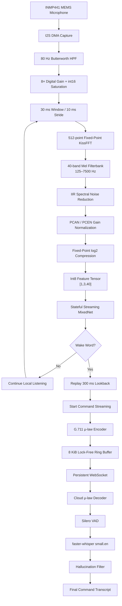

---

# 5. ESP32-S3 Audio Pipeline

The ESP32-S3 performs the latency-sensitive audio work locally.

The main pipeline is:

```text
I2S
 │
 ▼
DMA Buffer
 │
 ▼
80 Hz High-Pass Biquad
 │
 ▼
Digital Gain
 │
 ▼
30 ms Audio Window
 │
 ▼
512-point FFT
 │
 ▼
40 Mel Channels
 │
 ▼
Noise Reduction
 │
 ▼
PCAN
 │
 ▼
log₂ Compression
 │
 ▼
int8 Tensor
 │
 ▼
Streaming KWS
```

The frontend is designed specifically for continuous operation on an MCU rather than desktop-class floating-point processing.

---

# 6. Acoustic DSP Frontend

## 6.1 80 Hz Butterworth High-Pass Filter

The INMP441 microphone produces a 24-bit I2S signal containing a significant DC component and low-frequency drift.

A second-order **80 Hz Butterworth high-pass biquad** is therefore applied before amplification.

```text
Raw I2S
   │
   ▼
┌─────────────────────┐
│ 2nd Order Butterworth│
│      HPF @ 80 Hz    │
└─────────────────────┘
   │
   ▼
Cleaned Audio
   │
   ▼
8× Digital Gain
   │
   ▼
int16 Saturation
```

This removes low-frequency/DC components while preserving the relevant speech spectrum.

---

## 6.2 Windowing

Audio is processed using:

| Parameter        |       Value |
| ---------------- | ----------: |
| Window           |       30 ms |
| Stride           |       10 ms |
| Feature channels |          40 |
| FFT              |   512-point |
| Frequency range  | 125–7500 Hz |

This gives the model a continuous stream of short acoustic feature frames.

---

## 6.3 Mel Filterbank

The FFT spectrum is converted into **40 Mel-frequency channels**.

```text
512-point FFT
      │
      ▼
Frequency Spectrum
      │
      ▼
40 Triangular Mel Filters
      │
      ▼
40-dimensional acoustic representation
```

The Mel representation concentrates model capacity around the frequency structure relevant to human speech.

---

## 6.4 IIR Spectral Noise Reduction

Stationary background noise is tracked independently for each frequency channel.

The system uses different smoothing coefficients for the noise estimator:

```text
even_smoothing = 0.025
odd_smoothing  = 0.06
```

The estimated background spectrum is then reduced before the signal reaches the neural network.

This helps the model operate under varying acoustic conditions.

---

## 6.5 PCAN / PCEN Gain Normalization

The frontend performs per-channel automatic gain normalization.

The normalization is based on:

```text
(ε + M(t,f))^(-α)
```

with:

```text
α / strength ≈ 0.95
offset = 80.0
```

Instead of performing expensive floating-point `powf()` operations, the implementation uses a precomputed **16-bit lookup table**.

### Why this matters

```text
Floating-point pow()
        ↓
Expensive MCU operation

Lookup-table approximation
        ↓
Integer arithmetic
        ↓
Predictable latency
        ↓
Lower MCU cost
```

---

## 6.6 Fixed-Point log₂ Compression

The resulting feature values have a large dynamic range.

A fixed-point `log₂` transform compresses this range and produces the final representation expected by the int8 model.

---

# 7. Stateful Streaming TinyML

## 7.1 Conventional Approach

A traditional KWS system may repeatedly process an entire 1.5-second feature window:

```text
[149 frames × 40 features]
              ↓
          CNN inference
```

When a new 10–30 ms frame arrives, most of that window has already been processed.

This causes substantial redundant computation.

---

## 7.2 Our Streaming Approach

The model processes only the newest frames:

```text
New audio
   ↓
3 newest feature frames
   ↓
[1, 3, 40] int8
   ↓
Streaming MixedNet
```

Historical context is maintained internally using **TFLite Micro Resource Variables**.

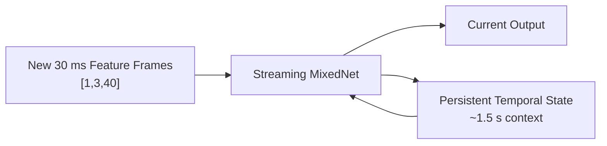

The model therefore does not need to recompute the complete historical spectrogram for every inference.

---

## 7.3 Model Characteristics

| Property         |              Value |
| ---------------- | -----------------: |
| Model            | Streaming MixedNet |
| Quantization     |          Full int8 |
| Flash model size |       60,896 bytes |
| Approx. size     |            60.9 KB |
| Tensor arena     |             ~26 KB |
| Input            |         `[1,3,40]` |
| Context          |             ~1.5 s |
| Inference        |           ~0.88 ms |
| Acceleration     |             ESP-NN |

The architecture uses multi-scale depthwise-separable convolution components.

---

# 8. Custom TFLite Micro Kernels

Streaming inference requires frequent movement of state tensors.

The baseline implementation used:

```text
10 × STRIDED_SLICE
8 × CONCATENATION
2 × SPLIT_V
```

per inference.

Standard implementations repeatedly perform tensor-shape and multidimensional-index calculations.

For a highly constrained MCU, this overhead becomes significant.

---

## 8.1 Custom Optimization

The project introduces custom registrations:

```text
Register_STRIDED_SLICE_FAST
Register_CONCATENATION_FAST
Register_SPLIT_V_FAST
```

The important optimization is:

```text
Prepare()
   │
   ├── Calculate tensor dimensions
   ├── Calculate contiguous offsets
   └── Cache memory layout
            │
            ▼
Eval()
   │
   └── Direct memcpy
```

Instead of repeatedly calculating the same offsets during inference, the offsets are calculated once.

---

## 8.2 Performance Impact

```text
Before optimization
        ↓
     1.07 ms

Custom fast kernels
        ↓
     0.88 ms
```

Measured improvement:

**~18% reduction in inference time.**

The supplied benchmark reports bit-exact outputs across **226 benchmark clips**.

---

# 9. Adaptive Quiet Gate

Continuous neural-network inference is unnecessary when the acoustic environment remains quiet.

The system therefore tracks the room noise floor.

If audio remains within approximately **6 dB of the tracked noise floor for more than 1.6 seconds**, neural-network inference can pause.

The acoustic frontend continues running so that environmental conditions remain tracked.

---

## 9.1 Quiet Gate Flow

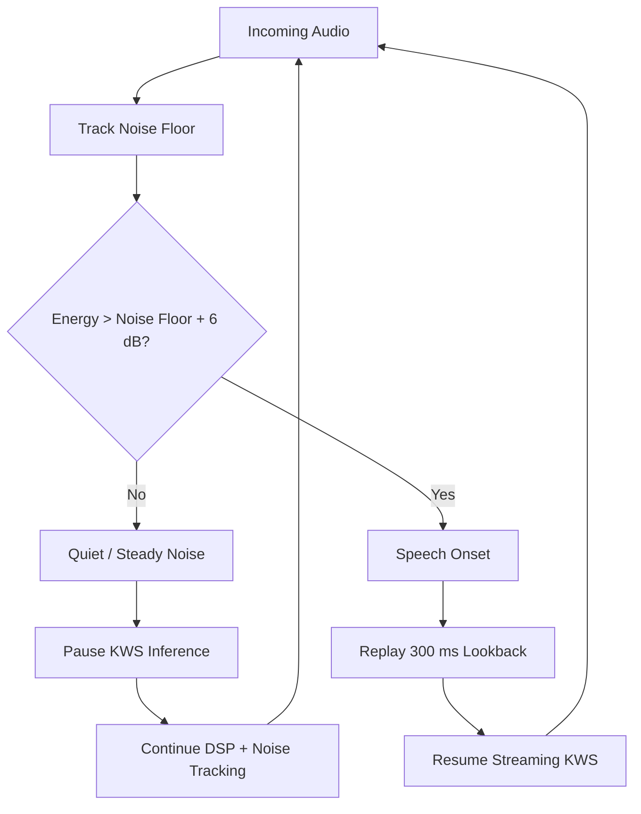

---

## 9.2 300 ms Lookback

A circular buffer stores approximately:

```text
30 feature frames
≈ 300 ms
```

When speech begins, those buffered frames are replayed through the model.

This is important for words with soft initial phonemes.

Example:

```text
Actual speech:

"Marvin"
  ↑
  M = low-energy onset

Without lookback:
[M] may be missed

With lookback:
[300 ms before trigger]
        ↓
replayed through KWS
        ↓
better onset preservation
```

---

# 10. Dual-Core Architecture

The ESP32-S3 contains two CPU cores.

The project uses asymmetric task assignment.

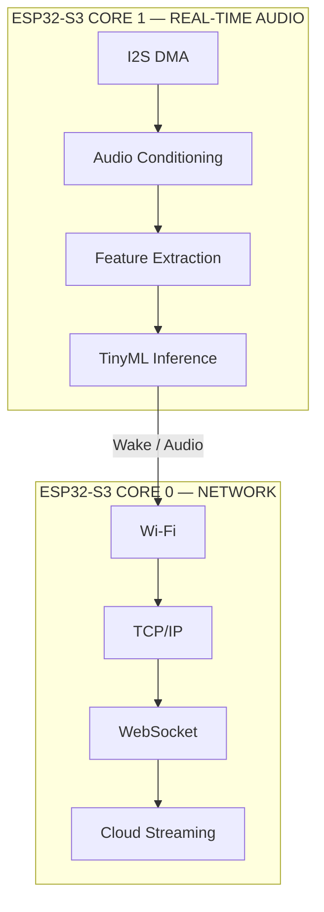

### Core 1

Handles:

* I2S DMA capture
* Audio preprocessing
* DSP
* Feature extraction
* TinyML inference

Measured CPU:

**~8.40%**

### Core 0

Handles:

* Wi-Fi
* TCP/IP
* WebSocket
* Audio streaming

Measured CPU:

**~0.78%**

This isolation prevents network activity from directly blocking the real-time audio processing path.

---

# 11. Audio Ring Buffer

The two cores communicate through an **8 KiB lock-free circular buffer**.

```text
                CORE 1
                  │
                  │ write
                  ▼
        ┌──────────────────┐
        │   8 KiB Ring     │
        │     Buffer       │
        └──────────────────┘
                  │
                  │ read
                  ▼
                CORE 0
```

The implementation uses atomic write/read positions.

```text
Core 1
  │
  ├── encode audio
  ├── write buffer
  └── advance atomic write index

Core 0
  │
  ├── read buffer
  ├── transmit
  └── advance atomic read index
```

No mutex is required for the audio handoff.

The reported test result is:

```text
I2S dropped frames = 0
```

---

# 12. Keyword Detection to Cloud Handoff

The cloud is not continuously fed raw microphone data.

The high-level state machine is:

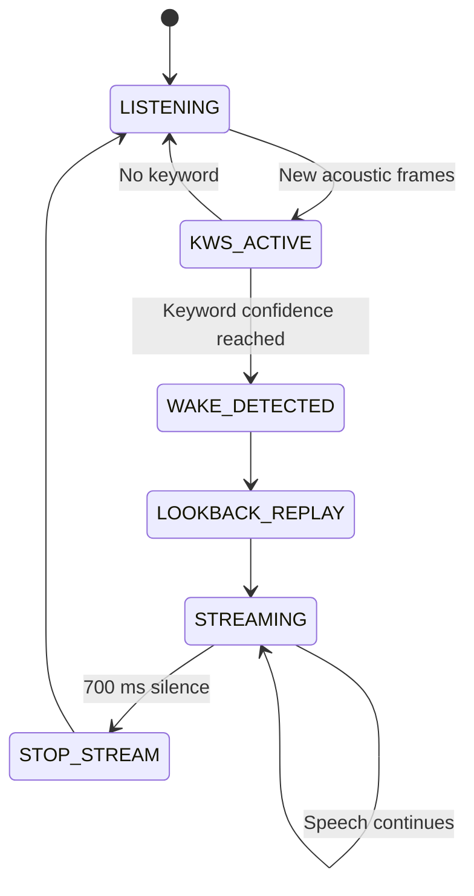

---

## Streaming Trigger

Once the wake word is detected:

1. The recent lookback audio is preserved.
2. Command streaming begins.
3. PCM audio is converted to μ-law.
4. Compressed audio enters the ring buffer.
5. Core 0 transmits it over the persistent WebSocket.
6. The cloud server decodes it.
7. Silero VAD detects speech.
8. `faster-whisper` performs ASR.
9. A hallucination filter removes known prompt-echo/loop artifacts.

---

# 13. μ-law Audio Compression

Raw 16-bit PCM at 16 kHz requires approximately:

```text
16,000 samples/s × 16 bits
= 256 kbps
```

The system converts the audio to **8-bit G.711 μ-law**:

```text
16-bit PCM
     ↓
G.711 μ-law
     ↓
8-bit audio
```

Result:

```text
256 kbps PCM
      ↓
128 kbps μ-law
```

This provides approximately **50% reduction in raw audio payload bandwidth**.

The implementation sends approximately:

```text
320 bytes / 20 ms frame
```

---

# 14. Cloud ASR Pipeline

The server-side architecture is:


---

## 14.1 Node.js μ-law Decoder

The cloud server reconstructs the audio from 8-bit μ-law values.

A **256-entry lookup table** is used rather than repeatedly performing an expensive mathematical decode.

```text
μ-law byte
    ↓
256-entry LUT
    ↓
PCM sample
```

---

## 14.2 Silero VAD

The decoded audio is passed through **Silero VAD**.

Its role is to distinguish speech from non-speech regions before ASR processing.

---

## 14.3 faster-whisper

The ASR stage uses:

```text
faster-whisper
model: small.en
quantization: int8
```

The resulting transcription is passed through a hallucination filter.

---

## 14.4 Hallucination Filtering

The supplied evaluation reports that the filter eliminated:

```text
15 / 15
```

tested Whisper prompt-echo/loop hallucinations.

Reported command word error rate:

```text
5.3% WER
```

---

# 15. Model Training

The wake-word model was trained **from scratch** rather than using pre-trained wake-word weights.

The training pipeline combines multiple acoustic sources.

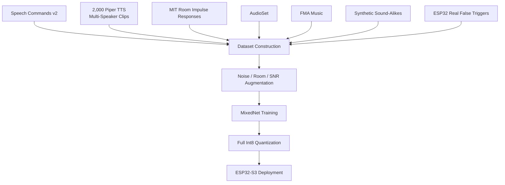

The training material includes:

* Speech Commands v2
* 2,000 synthetic multi-speaker Piper TTS clips
* MIT Room Impulse Responses
* AudioSet
* FMA music
* Synthetic phonetic confusables
* Real false-trigger recordings captured from the ESP32-S3

The supplied training setup includes augmentation across approximately **−5 dB to +10 dB SNR**.

---

# 16. Hard-Negative Mining

Wake-word systems often fail not because they cannot recognize the target word, but because other words sound acoustically similar.

The project explicitly targets these confusable words.

Examples include:

```text
Marvin
Martin
Marvel
Marble
Carving
Margin
...
```

The hard-negative set contains:

```text
6,400 synthetic clips
16 phonetic sound-alike classes
+
real false triggers from ESP32-S3
```

---

## Hard-Negative Training Loop

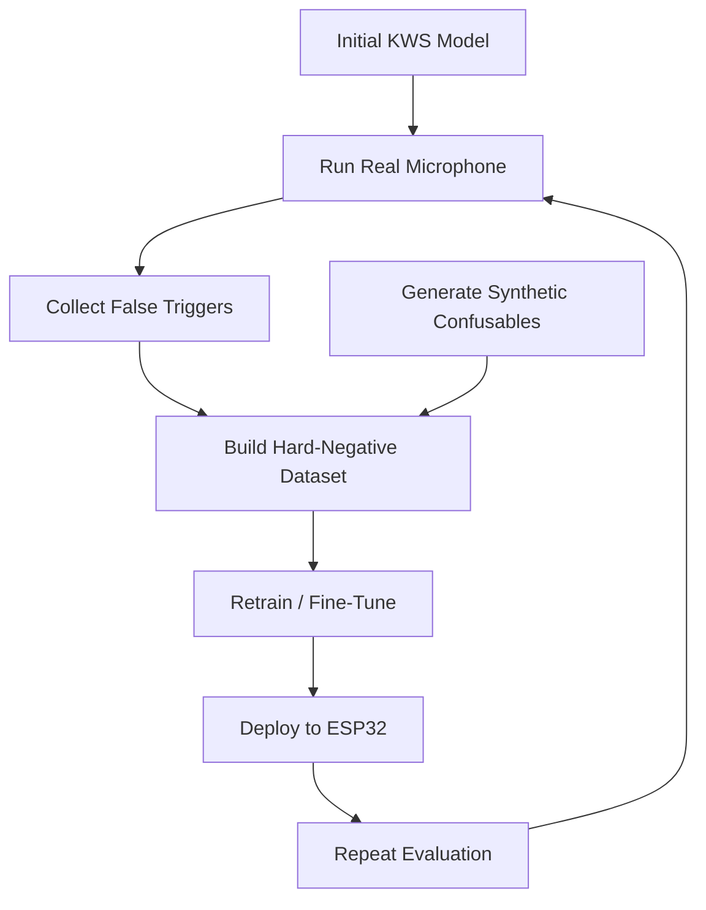

The supplied material identifies a `HARD_NEG_WEIGHT` of **3.0** in the training configuration.

---

# 17. Memory Optimization

One of the primary engineering constraints is the strict internal SRAM budget.

The target boundary is:

```text
256 KiB internal SRAM
0 bytes PSRAM
```

The reported peak breakdown is:

| Component               |      Memory |
| ----------------------- | ----------: |
| IRAM executable code    |    54.0 KiB |
| Static `.data` / `.bss` |    40.5 KiB |
| Peak active heap        |   150.5 KiB |
| **Total**               | **245 KiB** |

Therefore:

```text
245 KiB used
─────────────
256 KiB limit

≈ 11 KiB remaining margin
```

---

## Major Memory Optimizations

### IRAM relocation

Non-critical functions were moved from IRAM to Flash.

Reported reduction:

```text
≈ 41.5 KiB IRAM
```

### Disabled components

The locked build profile disables unnecessary memory consumers including:

* NVS
* SoftAP
* IPv6

### I2S DMA tuning

DMA buffers are configured around:

```text
3 × 20 ms
```

### PSRAM

The production configuration intentionally uses:

```text
PSRAM = DISABLED
```

This demonstrates that the system can operate within the specified internal-memory constraint rather than relying on additional external RAM.

---

# 18. CPU Optimization

The continuous-listening CPU budget is:

```text
< 10%
```

Reported measurements:

| Operating Condition          |        CPU |
| ---------------------------- | ---------: |
| Continuous background speech | 9.18% mean |
| Maximum observed             |       9.6% |
| Quiet room                   | 8.51% mean |

The architecture therefore combines several independent optimizations:

```text
Streaming inference
       +
Int8 quantization
       +
ESP-NN acceleration
       +
Custom memcpy kernels
       +
Quiet-room gating
       +
Dual-core isolation
       ↓
Low continuous CPU utilization
```

---

# 19. Boot Self-Test

The firmware includes an automated boot-time self-test.

The goal is to verify that:

* The TensorFlow Lite Micro arena is usable.
* The feature frontend is functional.
* Noise does not falsely trigger the model.
* A known reference WAV produces the expected wake-word response.

---

## Boot Sequence

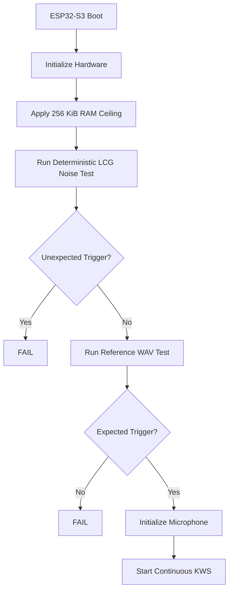

The self-test is designed to complete in **under one second**.

---

# 20. Deterministic Hardware-in-the-Loop Testing

Live microphone testing is useful, but it is difficult to reproduce exactly.

The firmware therefore provides a dedicated:

```text
KWS_INJECT_TEST
```

build mode.

Frozen WAV files can be sent through UART at:

```text
921600 baud
```

and injected directly into the KWS processing path.

This allows deterministic regression testing.

```text
Reference WAV
     ↓
UART @ 921600
     ↓
ESP32-S3
     ↓
ww_process()
     ↓
KWS model
     ↓
Detection result
```

The supplied benchmark reports:

```text
Real frozen test clips:
33 / 33 detected
TPR = 100%
```

---

# 21. Performance Metrics

## Core Metrics

| Metric                   |            Result |
| ------------------------ | ----------------: |
| Model size               |       **60.9 KB** |
| Model format             |          **int8** |
| Tensor arena             |        **~26 KB** |
| Strict SRAM              |       **245 KiB** |
| SRAM limit               |       **256 KiB** |
| PSRAM                    |           **0 B** |
| Mean continuous CPU      |         **9.18%** |
| Quiet-room CPU           |         **8.51%** |
| KWS inference            |       **0.88 ms** |
| Baseline inference       |       **1.07 ms** |
| Kernel improvement       |           **18%** |
| Cloud handoff latency    | **122 ms median** |
| Board buffering/encoding |        **~20 ms** |
| μ-law bitrate            |      **128 kbps** |
| Audio payload reduction  |           **50%** |
| Frozen test TPR          |  **100% (33/33)** |
| Command WER              |          **5.3%** |
| I2S dropped frames       |             **0** |

---

# 22. Resource Budget

The design deliberately targets a constrained hardware envelope.

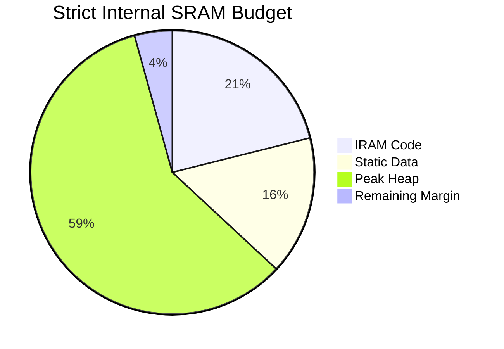

Approximate interpretation:

```text
256 KiB total
│
├── 54.0 KiB   IRAM
├── 40.5 KiB   Static memory
├── 150.5 KiB  Peak heap
└── ~11 KiB    Remaining margin
```

No PSRAM is required for the reported configuration.

---

# 23. Reliability & Fault Handling

The firmware includes multiple defensive mechanisms.

## Microphone Diagnostics

At boot, the system checks the I2S input for:

* Dead input
* Floating input
* Wiring problems

This helps identify microphone failures before entering continuous operation.

---

## Network Recovery

The streaming implementation includes:

```text
1 second WebSocket reconnection
2 second keep-alive ping
20 second hotspot-stall tolerance
```

The objective is to prevent transient Wi-Fi problems from permanently stopping the device.

---

## Silence Detection

The stream automatically stops after approximately:

```text
700 ms silence
```

relative to the tracked noise floor.

This avoids sending unnecessary trailing audio to the cloud.

---

# 24. Security Considerations

The current development configuration uses a local WebSocket transport.

For production/public deployment, the planned upgrade is:

```text
ws://
 ↓
wss://
```

with:

* TLS encryption
* Device token authentication

The supplied roadmap also considers **4-bit IMA-ADPCM** for reducing streaming bandwidth further.

Potential future path:

```text
Current:
16-bit PCM
    ↓
8-bit μ-law
    ↓
128 kbps

Production optimization:
16-bit PCM
    ↓
4-bit IMA-ADPCM
    ↓
64 kbps
```

---

# 25. Current Limitations

## 25.1 Phonetic False Triggers

Phonetically similar words remain a challenge for wake-word systems.

The supplied evaluation identifies examples such as:

```text
Martin
Marvel
Melvin
```

and reports a synthetic sound-alike trigger rate of approximately **45% at a 0.6 cutoff** for the identified evaluation condition.

The mitigation strategy is:

```text
Hard-negative generation
        +
Real-device false-trigger mining
        +
Weighted retraining
        +
Repeated on-device evaluation
```

---

## 25.2 Tight Resource Margin

The measured system uses:

```text
245 KiB / 256 KiB
```

leaving relatively little memory headroom.

Therefore, arbitrary additions to:

* Wi-Fi buffers
* model size
* DSP buffers
* logging
* network features
* application logic

could violate the memory constraint.

The project therefore uses a locked build profile and automated regression checks.

---

## 25.3 Network Dependency for ASR

Wake-word detection is local, but full command transcription currently depends on the cloud ASR backend.

Therefore:

```text
Offline:
Wake-word detection → available

No network:
Cloud transcription → unavailable
```

A future fully offline ASR path would require significantly more compute and memory.

---

# 26. Production Roadmap

## Phase 1 — Current Edge KWS

```text
ESP32-S3
+
INMP441
+
60.9 KB int8 KWS
+
Local wake-word detection
```

## Phase 2 — Secure Streaming

```text
ws://
 ↓
wss://
+
Device authentication
```

## Phase 3 — Lower Bandwidth

```text
128 kbps μ-law
       ↓
64 kbps IMA-ADPCM
```

## Phase 4 — Improved False-Trigger Robustness

```text
Field deployment
      ↓
False-trigger collection
      ↓
Hard-negative mining
      ↓
Retraining
      ↓
Firmware update
```

## Phase 5 — Larger-Scale Deployment

The architecture can be extended into a distributed edge-device system:

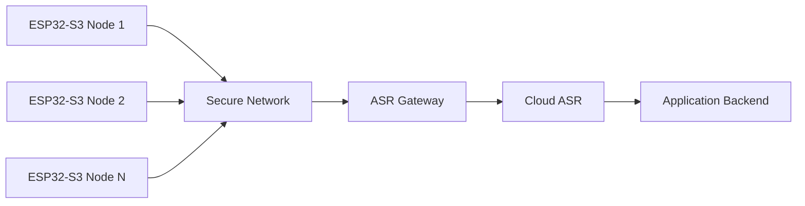

The key advantage is that continuous audio does not need to be streamed from every device.

---

# 27. Project Structure

A representative firmware organization is:

```text
kws_s3/
│
├── main/
│   ├── main.c
│   ├── audio_input.c
│   ├── wake_word.cpp
│   ├── fast_ops.cc
│   ├── streamer.c
│   ├── mic_align.c
│   └── wav_selftest.c
│
├── components/
│   └── esp-micro-speech-features/
│       ├── frontend.c
│       ├── noise_reduction.c
│       ├── pcan_gain_control.c
│       └── log_scale.c
│
├── training/
│   └── SIH_marvin_retrain_v2.ipynb
│
└── tools/
    └── export_training_clips.py
```

---

# 28. Judge Q&A Cheat Sheet

## Q: What is actually running on the ESP32?

A:

> A 60.9 KB fully-int8 Stateful Streaming MixedNet performs local wake-word detection. The acoustic frontend performs fixed-point Mel feature extraction, noise reduction, PCAN/PCEN normalization and log compression.

---

## Q: Why don't you send audio continuously to the cloud?

A:

> Continuous cloud streaming wastes bandwidth and cloud compute on background audio. The ESP32 performs wake-word detection locally and activates cloud streaming only after detecting the keyword.

---

## Q: Why is your model so small?

A:

> The model is fully int8 quantized and uses a streaming architecture with depthwise-separable convolutions. It processes only the newest three feature frames while maintaining temporal context internally.

---

## Q: Why not use a conventional CNN?

A:

> A conventional sliding-window CNN repeatedly recomputes features from historical frames. The streaming architecture retains historical state and processes only newly arrived frames.

---

## Q: How much RAM does the system use?

A:

> Under the strict reported accounting, peak internal SRAM usage is approximately 245 KiB against a 256 KiB limit, with PSRAM disabled.

---

## Q: How do you prove the memory limit?

A:

> The firmware calculates the allowable RAM boundary at boot and reserves the remaining memory as a ballast, enforcing the 256 KiB physical limit during execution.

---

## Q: How fast is inference?

A:

> Approximately 0.88 ms per streaming inference after custom TFLite Micro data-movement kernel optimization.

---

## Q: What did the custom kernels improve?

A:

> They precompute tensor offsets during `Prepare()` and use direct memory copies during `Eval()`, reducing inference time from approximately 1.07 ms to 0.88 ms.

---

## Q: How do you handle noise?

A:

> The frontend combines an 80 Hz high-pass filter, per-channel IIR spectral noise reduction, PCAN/PCEN normalization and logarithmic compression.

---

## Q: How do you avoid missing the beginning of a wake word?

A:

> We maintain a 300 ms circular feature lookback. When speech begins, those buffered frames are replayed through the model so low-energy leading phonemes are not discarded.

---

## Q: What happens after wake-word detection?

A:

> The device begins sending compressed audio over a persistent WebSocket. The server decodes μ-law, applies Silero VAD, performs ASR using faster-whisper and filters known hallucination patterns.

---

## Q: Why μ-law?

A:

> It converts 16-bit PCM to 8-bit G.711 μ-law, reducing the raw payload from approximately 256 kbps to 128 kbps.

---

## Q: What is the measured cloud handoff latency?

A:

> The reported median keyword-end-to-server arrival latency is approximately 122 ms, including roughly 100 ms sliding-window confirmation, 20 ms board buffering/encoding and approximately 1–2 ms Wi-Fi transfer under the reported test setup.

---

## Q: How do you test the model reproducibly?

A:

> The firmware supports a UART injection mode where frozen WAV files are transmitted at 921600 baud directly into the KWS processing path, allowing deterministic hardware-in-the-loop regression testing.

---

## Q: What is your current accuracy?

A:

> The supplied frozen real test set reports 33/33 wake-word detections, corresponding to 100% TPR for that test set. Cloud command recognition is reported at 5.3% WER.

The test-set size and evaluation conditions should be considered when interpreting these figures.

---

# 29. Key Engineering Innovations

## 1. Stateful Streaming TinyML

Instead of repeatedly evaluating a full historical spectrogram:

```text
Traditional:
1.5 s window → CNN → repeat

This system:
30 ms new frames
      ↓
stateful model
      ↓
persistent context
```

---

## 2. Hardware-Aware Fixed-Point DSP

The frontend avoids unnecessary floating-point computation.

```text
FFT
 ↓
Mel
 ↓
Noise Reduction
 ↓
Integer PCAN
 ↓
LUT
 ↓
Fixed-point log₂
 ↓
int8
```

---

## 3. Custom TFLite Micro Kernels

The project optimizes the state-management portion of the model rather than focusing exclusively on convolution speed.

```text
Repeated tensor indexing
        ↓
Precomputed offsets
        ↓
Direct memcpy
```

---

## 4. Adaptive Compute Gating

The model does not need to run at full rate during every quiet period.

```text
Quiet
 ↓
Inference paused

Speech onset
 ↓
300 ms replay
 ↓
Inference resumed
```

---

## 5. Asymmetric Dual-Core Design

```text
Core 1
Real-time audio + KWS

Core 0
Wi-Fi + WebSocket
```

This separates deterministic audio processing from network variability.

---

## 6. Hardware-Enforced Resource Compliance

The project does not merely report that memory usage is below 256 KiB.

The firmware actively enforces the boundary during boot and execution.

---

## 7. Edge-to-Cloud Compute Partitioning

The system intentionally places each workload where it is most practical:

```text
ESP32-S3
────────────
Wake-word detection
Audio preprocessing
Compression
Real-time control

Cloud
────────────
VAD
Large ASR
Command transcription
```

This avoids trying to run a large ASR model on a highly constrained MCU while also avoiding continuous cloud audio streaming.

---

# 30. Conclusion

This project demonstrates a complete **edge-to-cloud speech pipeline** running from a highly constrained ESP32-S3 platform.

The central design principle is:

> **Do the smallest amount of computation necessary on the edge to decide when expensive computation is actually required.**

The resulting architecture combines:

```text
             ┌─────────────────────────────┐
             │       ESP32-S3 EDGE         │
             │                             │
Mic ────────►│ DSP → Features → TinyML     │
             │             │               │
             │             ▼               │
             │        Wake Word            │
             │             │               │
             │             ▼               │
             │      μ-law + WebSocket      │
             └─────────────┬───────────────┘
                           │
                           ▼
             ┌─────────────────────────────┐
             │          CLOUD              │
             │                             │
             │ μ-law → VAD → Whisper       │
             │             ↓               │
             │       Command Text          │
             └─────────────────────────────┘
```

### Final reported system metrics

**60.9 KB model • 245 KiB strict SRAM • 0 B PSRAM • 0.88 ms KWS inference • 9.18% mean CPU • 122 ms median cloud handoff • 128 kbps μ-law • 33/33 frozen real test clips • 5.3% command WER**

The architecture is designed around measurable resource limits, deterministic testing, hardware-aware optimization, and a clear path toward secure production deployment.
