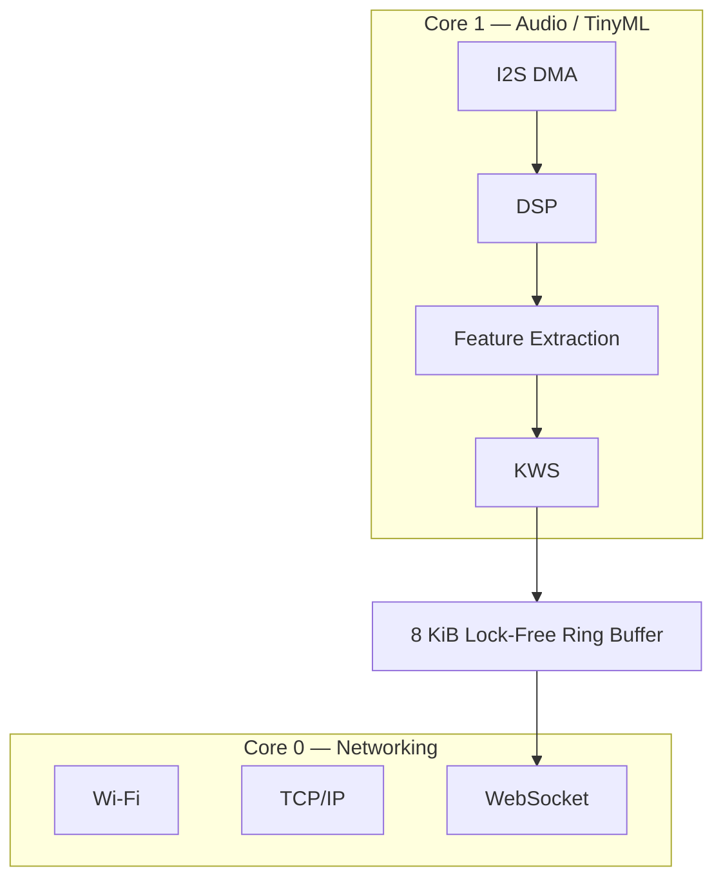
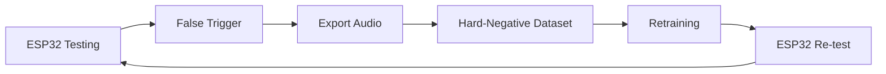
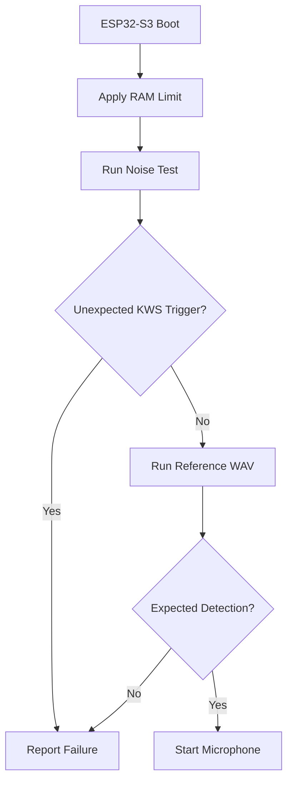
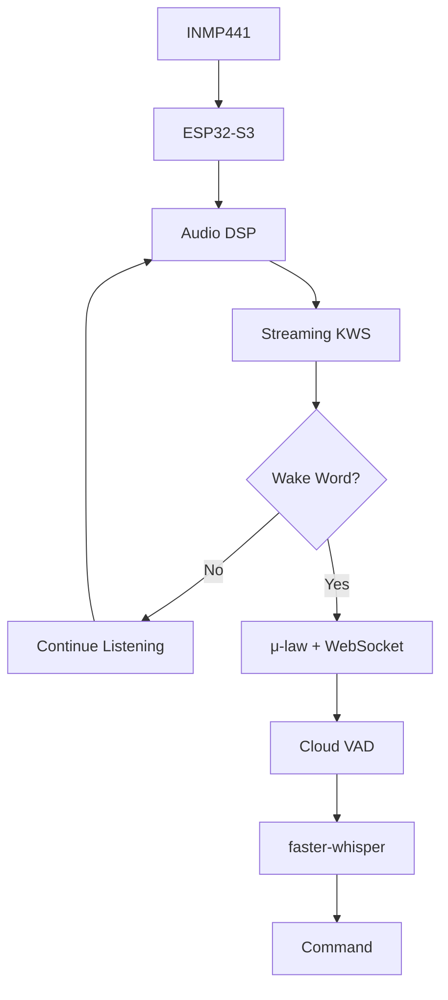

# ESP32-S3 Edge Keyword Spotting & Cloud ASR

> **Ultra-lightweight, always-on Keyword Spotting (KWS) with low-latency cloud ASR handoff on ESP32-S3.**

This project implements an **edge-to-cloud speech pipeline** where the ESP32-S3 continuously performs wake-word detection locally. Only after detecting the wake word does it stream audio to a cloud server for speech recognition.

The system is designed around strict embedded constraints:

* **60.9 KB Int8 KWS model**
* **245 KiB peak internal SRAM**
* **0 B PSRAM**
* **0.88 ms KWS inference**
* **9.18% mean CPU usage**
* **122 ms median keyword-to-server latency**

---

## Architecture

```mermaid
flowchart LR

    MIC["INMP441<br/>I2S Microphone"]

    subgraph ESP["ESP32-S3"]
        CAP["I2S + DMA"]
        DSP["Audio Conditioning<br/>80 Hz HPF + Gain"]
        FE["Feature Extraction<br/>FFT → Mel → Noise Reduction → PCAN"]
        KWS["Streaming MixedNet<br/>60.9 KB Int8"]
        GATE["Quiet Gate<br/>+ 300 ms Lookback"]
        RING["8 KiB Lock-Free<br/>Ring Buffer"]
        WS["WebSocket<br/>TCP_NODELAY"]
    end

    subgraph CLOUD["Cloud ASR"]
        DEC["μ-law Decoder"]
        VAD["Silero VAD"]
        ASR["faster-whisper<br/>small.en / int8"]
        FILTER["Hallucination Filter"]
        OUT["Command Text"]
    end

    MIC --> CAP --> DSP --> FE --> KWS --> GATE
    GATE --> RING --> WS
    WS --> DEC --> VAD --> ASR --> FILTER --> OUT
```



---

# 1. End-to-End Flow

The system operates in two main stages.

### Stage 1 — Always-On Edge KWS

The ESP32-S3 continuously processes microphone audio locally:

```text
Microphone
    ↓
I2S Capture
    ↓
Audio Conditioning
    ↓
Feature Extraction
    ↓
Streaming KWS
    ↓
Wake Word Decision
```

No cloud connection is required for the wake-word inference itself.

### Stage 2 — Command Streaming

When the wake word is detected:

```text
Wake Word
   ↓
300 ms Lookback Replay
   ↓
μ-law Encoding
   ↓
Ring Buffer
   ↓
WebSocket
   ↓
Cloud ASR
   ↓
Command Transcript
```

---

# 2. Audio Capture & Conditioning

The system uses an **INMP441 I2S MEMS microphone**.

The audio frontend performs:

```text
I2S Audio
   ↓
2nd-order 80 Hz Butterworth HPF
   ↓
8× Digital Gain
   ↓
int16 Saturation
   ↓
30 ms Window / 10 ms Stride
```

The high-pass filter removes low-frequency/DC components before amplification.

The reported frontend processing time is approximately **1.4 ms per 30 ms audio window**.

---

# 3. Fixed-Point Feature Extraction

After audio conditioning, the system converts the waveform into compact acoustic features.


### Feature pipeline

| Stage              | Implementation  |
| ------------------ | --------------- |
| Window             | 30 ms           |
| Stride             | 10 ms           |
| FFT                | 512-point       |
| Mel bands          | 40              |
| Frequency range    | 125–7500 Hz     |
| Noise reduction    | Per-channel IIR |
| Gain normalization | PCAN            |
| Output             | Int8            |

The PCAN implementation uses a **16-bit lookup table** to avoid repeatedly performing floating-point power operations.

---

# 4. Stateful Streaming KWS

The wake-word model is a custom **Streaming MixedNet**.

Instead of processing a complete 1.5-second feature window every time, the model processes only the newest feature frames while retaining previous context.

```text
New audio
   ↓
3 new feature frames
   ↓
[1, 3, 40] Int8
   ↓
Streaming MixedNet
   ↓
Prediction
```

Previous temporal information is maintained using **TFLite Micro Resource Variables**.

### Model characteristics

| Property         |              Value |
| ---------------- | -----------------: |
| Architecture     | Streaming MixedNet |
| Quantization     |               Int8 |
| Model size       |            60.9 KB |
| Input            |         `[1,3,40]` |
| Tensor arena     |             ~26 KB |
| Temporal context |             ~1.5 s |
| Inference        |            0.88 ms |
| Acceleration     |             ESP-NN |

---

# 5. Custom TFLite Micro Kernels

Streaming state updates require repeated tensor operations.

The project implements optimized versions of:

```text
STRIDED_SLICE
CONCATENATION
SPLIT_V
```

The tensor offsets are calculated once during `Prepare()` instead of repeatedly during every `Eval()`.


### Measured result

```text
Standard implementation
       1.07 ms
          ↓
Custom kernels
       0.88 ms
```

**~18% reduction in inference time.**

The supplied benchmark reports bit-exact outputs across **226 benchmark clips**.

---

# 6. Adaptive Quiet Gate

The KWS model does not need to run continuously at full rate when the environment is quiet.

The firmware tracks the noise floor and can pause neural-network inference when the audio remains sufficiently close to the background level.

The frontend continues tracking the acoustic environment.

### Lookback Buffer

A **300 ms circular buffer** stores recent feature frames.

When speech begins:

```text
Speech onset
     ↓
Retrieve previous 300 ms
     ↓
Replay through KWS
     ↓
Continue normal inference
```

This is designed to prevent low-energy initial parts of a wake word from being lost.

---

# 7. Dual-Core ESP32-S3 Architecture

The two ESP32-S3 cores are separated by workload.



### Core 1

Responsible for:

* I2S capture
* Audio processing
* Feature extraction
* KWS inference

Reported CPU usage: **8.40%**

### Core 0

Responsible for:

* Wi-Fi
* TCP/IP
* WebSocket streaming

Reported CPU usage: **0.78%**

This separation prevents network processing from being directly coupled to the real-time audio pipeline.

---

# 8. Lock-Free Audio Buffer

Audio is transferred between the cores through an **8 KiB circular buffer**.

```text
Core 1
  │
  │ write
  ▼
┌──────────────────┐
│    8 KiB Ring    │
│      Buffer      │
└──────────────────┘
  │
  │ read
  ▼
Core 0
```

Atomic read/write positions are used instead of a mutex-based handoff.

Reported test result:

**0 dropped I2S frames.**

---

# 9. Wake Word → Cloud ASR

After the wake word is detected, the device starts streaming command audio.


---

# 10. μ-law Compression

The ESP32 converts 16-bit PCM audio to **8-bit G.711 μ-law**.

```text
16-bit PCM
256 kbps
   ↓
8-bit μ-law
128 kbps
```

This reduces the raw audio payload by approximately **50%**.

The streamer uses:

* Persistent WebSocket
* `TCP_NODELAY`
* 20 ms audio packets
* 128 kbps μ-law audio
* Automatic silence termination

The stream is stopped after approximately **700 ms of silence** relative to the tracked noise floor.

---

# 11. Cloud ASR

The server-side pipeline is:

```text
WebSocket
    ↓
μ-law Decoder
    ↓
Silero VAD
    ↓
faster-whisper small.en
    ↓
Hallucination Filter
    ↓
Command Text
```

The μ-law decoder uses a **256-entry lookup table**.

The ASR stage uses:

```text
faster-whisper
small.en
int8
```

The reported command recognition result is:

**5.3% WER**

---

# 12. Latency

The reported median latency from keyword end to server arrival is:

## **122 ms**

Reported breakdown:

```text
~100 ms  → keyword confirmation
~20 ms   → board buffering / encoding
~1–2 ms  → Wi-Fi transfer
────────────────────────
~122 ms  → median server arrival
```

The system maintains a persistent WebSocket and uses `TCP_NODELAY` to avoid additional delays from small TCP packets.

---

# 13. Model Training

The model was trained from scratch using multiple audio sources.

The supplied training setup includes:

* Speech Commands v2
* 2,000 synthetic multi-speaker Piper TTS clips
* MIT Room Impulse Responses
* AudioSet
* FMA music
* Synthetic phonetic sound-alikes
* Real false-trigger recordings from the ESP32-S3

The training data was augmented across approximately **−5 to +10 dB SNR**.

---

# 14. Hard-Negative Mining

Phonetically similar words can cause wake-word false triggers.

Examples include:

```text
Martin
Marvel
Marble
Carving
Margin
```

The hard-negative dataset contains approximately:

* **6,400 synthetic clips**
* **16 sound-alike classes**
* Real false-trigger recordings

The development loop is:



This allows false triggers found on the actual hardware to be fed back into training.

---

# 15. Memory Optimization

The system operates without PSRAM.

Reported strict memory usage:

| Resource            |       Usage |
| ------------------- | ----------: |
| IRAM code           |    54.0 KiB |
| Static `.data/.bss` |    40.5 KiB |
| Peak heap           |   150.5 KiB |
| **Total**           | **245 KiB** |
| Limit               | **256 KiB** |
| PSRAM               |     **0 B** |

Major optimizations include:

* Moving non-critical code from IRAM to Flash
* Disabling NVS/SoftAP/IPv6 components
* I2S DMA tuning
* Custom tensor data-movement kernels
* Keeping PSRAM disabled

The firmware also uses a boot-time memory ballast mechanism to enforce the 256 KiB boundary.

---

# 16. CPU Usage

Reported continuous-listening CPU measurements:

| Condition                    |            CPU |
| ---------------------------- | -------------: |
| Continuous background speech | **9.18% mean** |
| Maximum reported             |       **9.6%** |
| Quiet room                   | **8.51% mean** |

The reported combined CPU usage remains below the project's **10% target**.

---

# 17. Hardware Self-Test

The firmware performs an automated boot-time test before normal microphone operation.



The self-test uses deterministic noise and an embedded reference WAV.

---

# 18. UART Injection Testing

For reproducible testing, the firmware provides `KWS_INJECT_TEST`.

Frozen WAV files can be injected through UART at **921600 baud** directly into the KWS processing path.

```text
Reference WAV
     ↓
UART
     ↓
ESP32-S3
     ↓
ww_process()
     ↓
KWS
     ↓
Detection
```

Reported frozen real-test result:

**33 / 33 detections (100% TPR).**

---

# 19. Reliability Features

The current firmware includes:

### Microphone diagnostics

Checks the I2S input during startup for dead/floating microphone lines.

### WebSocket recovery

The streaming implementation includes:

* 1-second reconnection
* 2-second keep-alive pings
* 20-second hotspot-stall tolerance

### Automatic stream termination

Streaming stops after approximately **700 ms of silence**.

---

# 20. Current Challenges

### 1. Phonetic False Triggers

Sound-alike words remain a challenge.

The current mitigation is hard-negative mining and retraining using real device recordings.

### 2. Tight SRAM Margin

Current reported usage:

```text
245 KiB / 256 KiB
```

This leaves limited room for additional memory-heavy features.

### 3. Network Security

The development configuration uses WebSocket streaming.

For production, the planned upgrade is:

```text
ws://
 ↓
wss://
+
device authentication
```

A future **4-bit IMA-ADPCM** mode is also identified as a possible reduction from 128 kbps to approximately 64 kbps.

---

# 21. Performance Summary

| Category           |        Result |
| ------------------ | ------------: |
| Model              |  60.9 KB Int8 |
| Inference          |       0.88 ms |
| Strict SRAM        |       245 KiB |
| SRAM limit         |       256 KiB |
| PSRAM              |      Disabled |
| CPU                |    9.18% mean |
| Cloud latency      | 122 ms median |
| μ-law bitrate      |      128 kbps |
| I2S dropped frames |             0 |
| Frozen TPR         |         33/33 |
| Command WER        |          5.3% |

---

# 22. Project Structure

```text
kws_s3/
│
├── main/
│   ├── main.c
│   ├── audio_input.c
│   ├── wake_word.cpp
│   ├── fast_ops.cc
│   ├── streamer.c
│   ├── mic_align.c
│   └── wav_selftest.c
│
├── components/
│   └── esp-micro-speech-features/
│       ├── frontend.c
│       ├── noise_reduction.c
│       ├── pcan_gain_control.c
│       └── log_scale.c
│
├── training/
│   └── SIH_marvin_retrain_v2.ipynb
│
└── tools/
    └── export_training_clips.py
```

---

# 23. Key Design Points

The project combines several optimizations specifically for constrained edge hardware:

1. **Stateful streaming KWS** instead of repeatedly processing the complete audio history.
2. **Fixed-point DSP** for predictable MCU execution.
3. **Custom TFLite Micro kernels** for faster state updates.
4. **Adaptive quiet gating** to reduce unnecessary inference.
5. **300 ms lookback** to preserve wake-word onset.
6. **Dual-core separation** between real-time audio and networking.
7. **Lock-free audio buffering** between cores.
8. **μ-law compression** to reduce streaming bandwidth.
9. **Hardware-enforced SRAM limit** for resource validation.
10. **Deterministic UART testing** for repeatable KWS evaluation.

---

## Final Architecture



### In one sentence

**The ESP32-S3 performs low-cost, always-on wake-word detection locally, then hands off only the required command audio to a cloud ASR pipeline, while staying within a strict 256 KiB internal-SRAM budget.**
